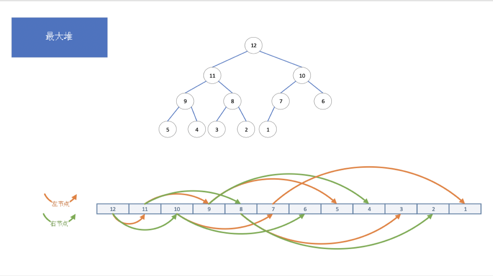
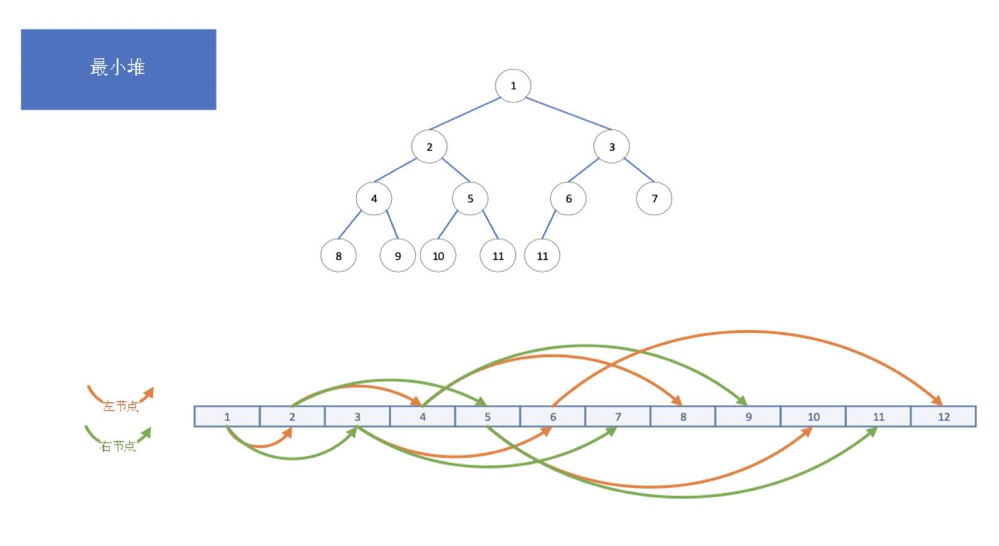

# 二叉堆

## 数组展现

+ 如果采用数组形式表现，则父节点的节点位置在n处，那么其左孩子节点为：2 * n + 1 ，其右孩子节点为2 * (n + 1)，其父节点为（n - 1） / 2 处

## 分类

+ 最大堆

+ 最小堆

## 插入节点

+ 插入位置是完全二叉树的最后一个位置，之后再依次与父节点进行比较，判断是否需要“上浮”

## 删除节点

+ 删除节点删除的永远都是堆顶的节点，之后再把最后一个节点的元素移到堆顶的位置，再依次与左右子节点中最小的节点进行对比，判断是否需要“下沉”