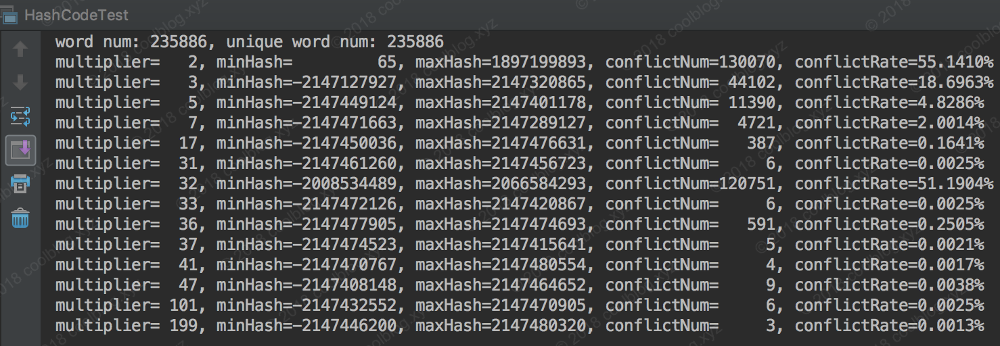
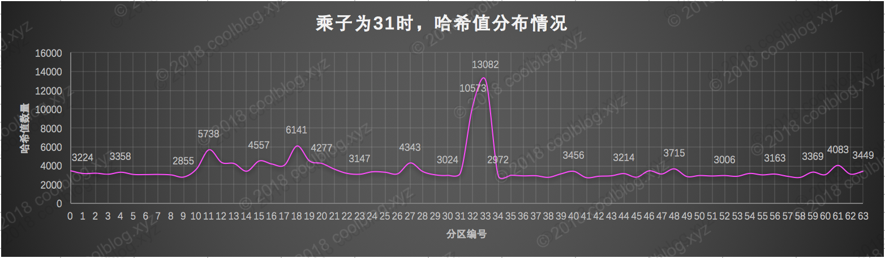
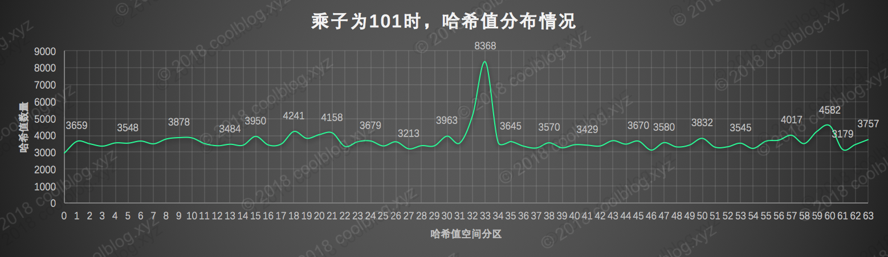

# 选择31做HashCode乘子的原因

```java
    1     /**
    2      * Returns a hash code for this string. The hash code for a
    3      * {@code String} object is computed as
    4      * <blockquote><pre>
    5      * s[0]*31^(n-1) + s[1]*31^(n-2) + ... + s[n-1]
    6      * </pre></blockquote>
    7      * using {@code int} arithmetic, where {@code s[i]} is the
    8      * <i>i</i>th character of the string, {@code n} is the length of
    9      * the string, and {@code ^} indicates exponentiation.
   10      * (The hash value of the empty string is zero.)
   11      *
   12      * @return  a hash code value for this object.
   13      */
   14     public int hashCode() {
   15         int h = hash;
   16         if (h == 0 && value.length > 0) {
   17             char val[] = value;
   18 
   19             for (int i = 0; i < value.length; i++) {
   20                 h = 31 * h + val[i];
   21             }
   22             hash = h;
   23         }
   24         return h;
   25     }
```

1. String 类的 hashCode 算法很简单，主要就是中间的 for 循环，计算公式如下：

	> s[0]*31^(n-1) + s[1]*31^(n-2) + ... + s[n-1]

   + s：数组即源码中的 val 数组，也就是构成字符串的字符数组。
   + 这里有个数字 31 ，为什么选择31作为乘积因子，而且没有用一个常量来声明？主要原因有两个：
      + 31是一个不大不小的质数，是作为 hashCode 乘子的优选质数之一。
      + 31可以被 JVM 优化，31 * i = (i << 5) - i。因为移位运算比乘法运行更快更省性能。

2. 上面的公式包括公式的推导并不是本文的重点，大家了解了解即可。接下来来说说本文的重点，即选择31的理由。从网上的资料来看，一般有如下两个原因：

   + 31是一个不大不小的质数，是作为 hashCode 乘子的优选质数之一。另外一些相近的质数，比如37、41、43等等，也都是不错的选择。那么为啥偏偏选中了31呢？请看第二个原因。
   + 31可以被 JVM 优化，31 * i = (i << 5) - i。
   + 上面两个原因中，第一个需要解释一下，第二个比较简单，就不说了。下面我来解释第一个理由。一般在设计哈希算法时，会选择一个特殊的质数。至于为啥选择质数，我想应该是可以降低哈希算法的冲突率。至于原因，这个就要问数学家了，我几乎可以忽略的数学水平解释不了这个原因。上面说到，31是一个不大不小的质数，是优选乘子。那为啥同是质数的2和101（或者更大的质数）就不是优选乘子呢，分析如下。
   + 这里先分析质数2。首先，假设 n = 6，然后把质数2和 n 带入上面的计算公式。并仅计算公式中次数最高的那一项，结果是2^5 = 32，是不是很小。所以这里可以断定，当字符串长度不是很长时，用质数2做为乘子算出的哈希值，数值不会很大。也就是说，哈希值会分布在一个较小的数值区间内，分布性不佳，最终可能会导致冲突率上升。
   + 上面说了，质数2做为乘子会导致哈希值分布在一个较小区间内，那么如果用一个较大的大质数101会产生什么样的结果呢？根据上面的分析，我想大家应该可以猜出结果了。就是不用再担心哈希值会分布在一个小的区间内了，因为101^5 = 10,510,100,501。但是要注意的是，这个计算结果太大了。如果用 int 类型表示哈希值，结果会溢出，最终导致数值信息丢失。尽管数值信息丢失并不一定会导致冲突率上升，但是我们暂且先认为质数101（或者更大的质数）也不是很好的选择。最后，我们再来看看质数31的计算结果：31^5 = 28629151，结果值相对于32和10,510,100,501来说。是不是很nice，不大不小。

3. 上面用了比较简陋的数学手段证明了数字31是一个不大不小的质数，是作为 hashCode 乘子的优选质数之一。接下来我会用详细的实验来验证上面的结论，不过在验证前，我们先看看 Stack Overflow 上关于这个问题的讨论，Why does Java's hashCode() in String use 31 as a multiplier?。其中排名第一的答案引用了《Effective Java》中的一段话，这里也引用一下：
	
    > The value 31 was chosen because it is an odd prime. If it were even and the multiplication overflowed, information would be lost, as multiplication by > 2 is equivalent to shifting. The advantage of using a prime is less clear, but it is traditional. A nice property of 31 is that the multiplication can > be replaced by a shift and a subtraction for better performance: `31 * i == (i << 5) - i``. Modern VMs do this sort of optimization automatically.
	
	简单翻译一下：
	
    > 选择数字31是因为它是一个奇质数，如果选择一个偶数会在乘法运算中产生溢出，导致数值信息丢失，因为乘二相当于移位运算。选择质数的优势并不是特别的明显，但这是一个传统。同时，数字31有一个很好的特性，即乘法运算可以被移位和减法运算取代，来获取更好的性能：31 * i == (i << 5) - i，现代的 Java 虚拟机可以自动的完成这个优化。
	
	排名第二的答案设这样说的：
	
    > As Goodrich and Tamassia point out, If you take over 50,000 English words (formed as the union of the word lists provided in two variants of Unix), using the constants 31, 33, 37, 39, and 41 will produce less than 7 collisions in each case. Knowing this, it should come as no surprise that many Java implementations choose one of these constants.
	
	这段话也翻译一下：
	
    > 正如 Goodrich 和 Tamassia 指出的那样，如果你对超过 50,000 个英文单词（由两个不同版本的 Unix 字典合并而成）进行 hash code 运算，并使用常数 31, 33, 37, 39 和 41 作为乘子，每个常数算出的哈希值冲突数都小于7个，所以在上面几个常数中，常数 31 被 Java 实现所选用也就不足为奇了。
	
	上面的两个答案完美的解释了 Java 源码中选用数字 31 的原因。接下来，我将针对第二个答案就行验证，请大家继续往下看.

4. 本节，我将使用不同的数字作为乘子，对超过23万个英文单词进行哈希运算，并计算哈希算法的冲突率。同时，我也将针对不同乘子算出的哈希值分布情况进行可视化处理，让大家可以直观的看到数据分布情况。本次实验所使用的数据是 Unix/Linux 平台中的英文字典文件，文件路径为 /usr/share/dict/words。
	
   + 哈希值冲突率计算：
    计算哈希算法冲突率并不难，比如可以一次性将所有单词的 hash code 算出，并放入 Set 中去除重复值。之后拿单词数减去 set.size() 即可得出冲突数，有了冲突数，冲突率就可以算出来了。当然，如果使用 JDK8 提供的流式计算 API，则可更方便算出，代码片段如下：

```java
    1 public static Integer hashCode(String str, Integer multiplier) {
    2     int hash = 0;
    3     for (int i = 0; i < str.length(); i++) {
    4         hash = multiplier * hash + str.charAt(i);
    5     }
    6 
    7     return hash;
    8 }
    9     
   10 /**
   11  * 计算 hash code 冲突率，顺便分析一下 hash code 最大值和最小值，并输出
   12  * @param multiplier
   13  * @param hashs
   14  */
   15 public static void calculateConflictRate(Integer multiplier, List<Integer> hashs) {
   16     Comparator<Integer> cp = (x, y) -> x > y ? 1 : (x < y ? -1 : 0);
   17     int maxHash = hashs.stream().max(cp).get();
   18     int minHash = hashs.stream().min(cp).get();
   19 
   20     // 计算冲突数及冲突率
   21     int uniqueHashNum = (int) hashs.stream().distinct().count();
   22     int conflictNum = hashs.size() - uniqueHashNum;
   23     double conflictRate = (conflictNum * 1.0) / hashs.size();
   24 
   25     System.out.println(String.format("multiplier=%4d, minHash=%11d, maxHash=%10d, conflictNum=%6d, conflictRate=%.4f%%",
   26                 multiplier, minHash, maxHash, conflictNum, conflictRate * 100));
   27 }
```



从上图可以看出，使用较小的质数做为乘子时，冲突率会很高。尤其是质数2，冲突率达到了 55.14%。同时我们注意观察质数2作为乘子时，哈希值的分布情况。可以看得出来，哈希值分布并不是很广，仅仅分布在了整个哈希空间的正半轴部分，即 0 ~ 231-1。而负半轴 -231 ~ -1，则无分布。这也证明了我们上面断言，即质数2作为乘子时，对于短字符串，生成的哈希值分布性不佳。然后再来看看我们之前所说的 31、37、41 这三个不大不小的质数，表现都不错，冲突数都低于7个。而质数 101 和 199 表现的也很不错，冲突率很低，这也说明哈希值溢出并不一定会导致冲突率上升。但是这两个家伙一言不合就溢出，我们认为他们不是哈希算法的优选乘子。最后我们再来看看 32 和 36 这两个偶数的表现，结果并不好，尤其是 32，冲突率超过了了50%。尽管 36 表现的要好一点，不过和 31，37相比，冲突率还是比较高的。当然并非所有的偶数作为乘子时，冲突率都会比较高，大家有兴趣可以自己验证。

   + 可视化显示



---


---

