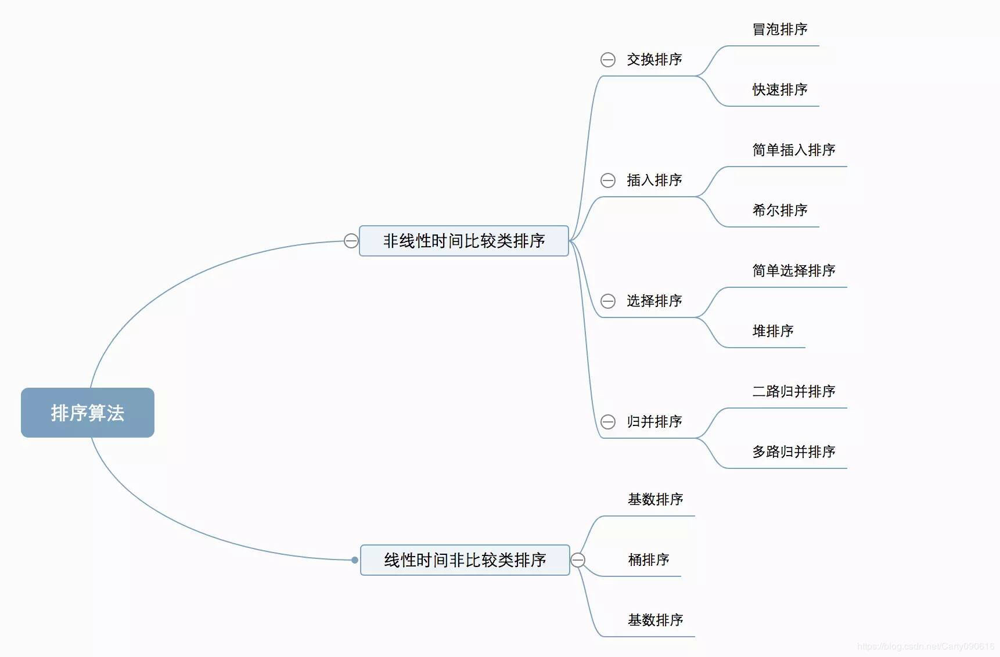
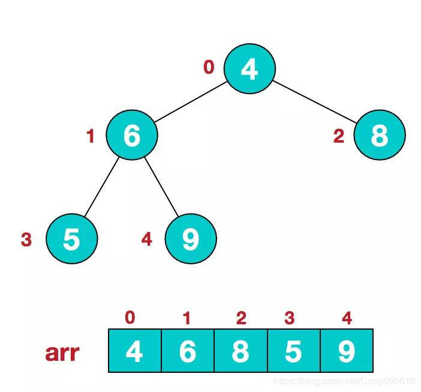
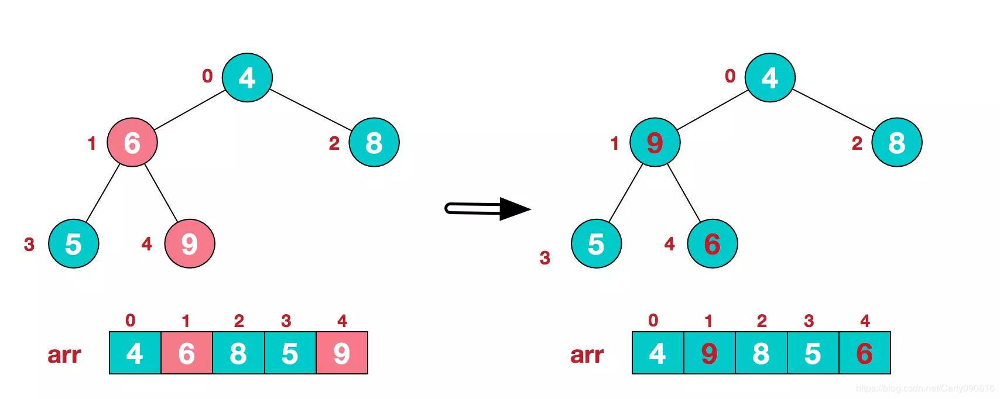
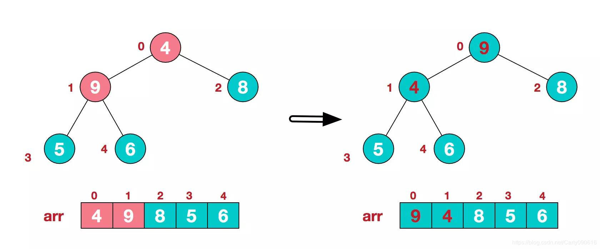
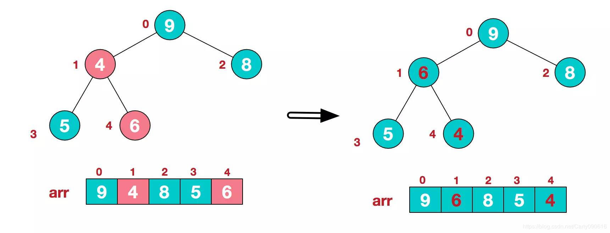
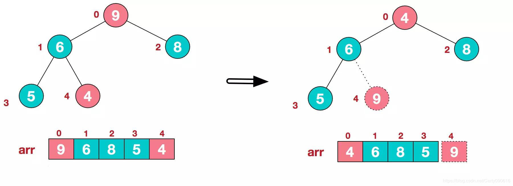
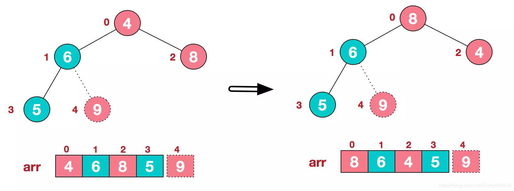
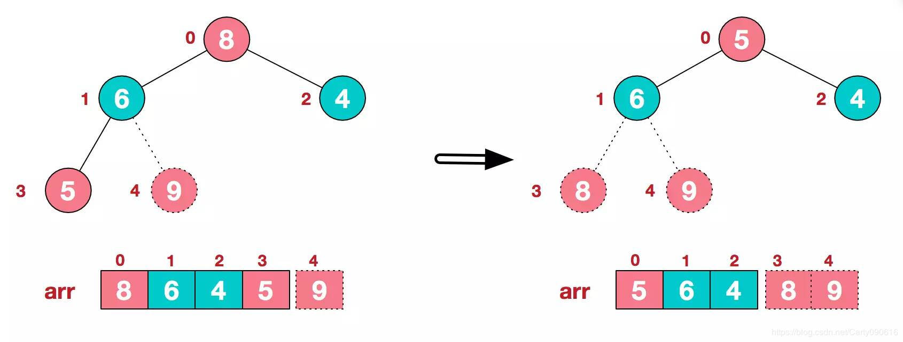
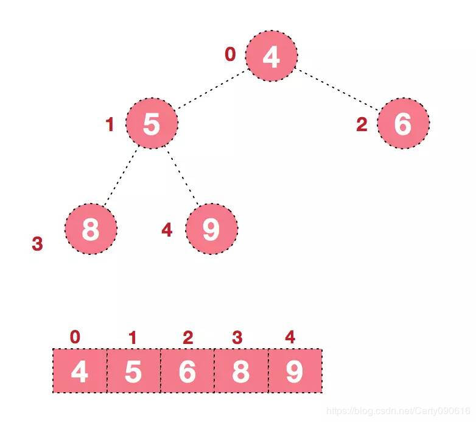
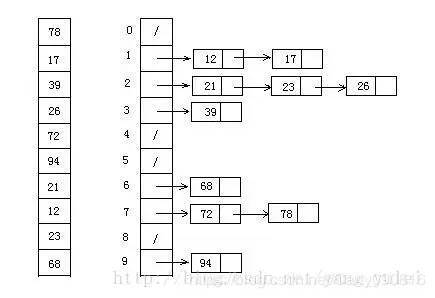

- [概述](#概述)
- [冒泡排序（Bubble Sort）](#冒泡排序bubble-sort)
- [选择排序（Selection Sort）](#选择排序selection-sort)
- [插入排序（Insertion Sort）](#插入排序insertion-sort)
- [希尔排序（Shell Sort）](#希尔排序shell-sort)
- [归并排序（Merge Sort）](#归并排序merge-sort)
- [快速排序（Quick Sort）](#快速排序quick-sort)
- [堆排序（Heap Sort）](#堆排序heap-sort)
- [计数排序（Counting Sort）](#计数排序counting-sort)
- [桶排序（Bucket Sort）](#桶排序bucket-sort)
- [基数排序（Radix Sort）](#基数排序radix-sort)
- [参考博客](#参考博客)

## 概述

1. 分类

> 非线性时间比较类排序：通过比较来决定元素间的相对次序，由于其时间复杂度不能突破O(nlogn)，因此称为非线性时间比较类排序。
> 线性时间非比较类排序：不通过比较来决定元素间的相对次序，它可以突破基于比较排序的时间下界，以线性时间运行，因此称为线性时间非比较类排序。 



2. 算法复杂度


> 稳定：如果a原本在b前面，而a=b，排序之后a仍然在b的前面。
> 不稳定：如果a原本在b的前面，而a=b，排序之后 a 可能会出现在 b 的后面。
> 时间复杂度：对排序数据的总的操作次数。反映当n变化时，操作次数呈现什么规律。
> 空间复杂度：是指算法在计算机内执行时所需存储空间的度量，它也是数据规模n的函数。 

---

## 冒泡排序（Bubble Sort）

冒泡排序是一种简单的排序算法。它重复地走访过要排序的数列，一次比较两个元素，如果它们的顺序错误就把它们交换过来。走访数列的工作是重复地进行直到没有再需要交换，也就是说该数列已经排序完成。这个算法的名字由来是因为越小的元素会经由交换慢慢“浮”到数列的顶端。 

1. 描述
   + 比较相邻的元素。如果第一个比第二个大，就交换它们两个；
   + 对每一对相邻元素作同样的工作，从开始第一对到结尾的最后一对，这样在最后的元素应该会是最大的数；
   + 针对所有的元素重复以上的步骤，除了最后一个；
   + 重复步骤1~3，直到排序完成。

2. 动画演示

   

3. 代码实现
    ```java
        public static void main(String[] args) {
            int[] array = {11, 33, 22, 44, 66, 77, 99, 55, 88};
            int temp = 0;
            for (int i = 0 ; i < array.length - 1 ; i++) {
                for (int j = 0 ; j < array.length - 1 - i ; j++) {
                    if (array[j] > array[j + 1]) {
                        temp = array[j];
                        array[j] = array[j + 1];
                        array[j + 1] = temp;
                    }
                }
            }
            System.out.println(Arrays.toString(array));
        }
    ```

---

## 选择排序（Selection Sort）

选择排序(Selection-sort)是一种简单直观的排序算法。它的工作原理：首先在未排序序列中找到最小（大）元素，存放到排序序列的起始位置，然后，再从剩余未排序元素中继续寻找最小（大）元素，然后放到已排序序列的末尾。以此类推，直到所有元素均排序完毕。 

1. 描述

    n个记录的直接选择排序可经过n-1趟直接选择排序得到有序结果。具体算法描述如下：

    + 初始状态：无序区为R[1..n]，有序区为空；
    + 第i趟排序(i=1,2,3…n-1)开始时，当前有序区和无序区分别为R[1..i-1]和R(i..n）。该趟排序从当前无序区中-选出关键字最小的记录 R[k]，将它与无序区的第1个记录R交换，使R[1..i]和R[i+1..n)分别变为记录个数增加1个的新有序区和记录个数减少1个的新无序区；
    + n-1趟结束，数组有序化了。

2. 动画演示

   

3. 代码实现
    ```java
        public static void main(String[] args) {
            int[] array = {11, 33, 22, 44, 66, 77, 99, 55, 88};
            int temp = 0;
            for (int i = 0 ; i < array.length - 1 ; i++) {
                int minIndex = i;
                for (int j = i + 1 ; j < array.length ; j++) {
                    if (array[j] < array[minIndex]) {
                        minIndex = j;
                    }
                }
                temp = array[i];
                array[i] = array[minIndex];
                array[minIndex] = temp;
            }
            System.out.println(Arrays.toString(array));
        }
    ```

4. 特点
    
    表现最稳定的排序算法之一，因为无论什么数据进去都是O(n2)的时间复杂度，所以用到它的时候，数据规模越小越好。唯一的好处可能就是不占用额外的内存空间了吧。

---

## 插入排序（Insertion Sort）

插入排序（Insertion-Sort）的算法描述是一种简单直观的排序算法。它的工作原理是通过构建有序序列，对于未排序数据，在已排序序列中从后向前扫描，找到相应位置并插入。

1. 描述

    一般来说，插入排序都采用in-place在数组上实现。具体算法描述如下：

    + 从第一个元素开始，该元素可以认为已经被排序；
    + 取出下一个元素，在已经排序的元素序列中从后向前扫描；
    + 如果该元素（已排序）大于新元素，将该元素移到下一位置；
    + 重复步骤3，直到找到已排序的元素小于或者等于新元素的位置；
    + 将新元素插入到该位置后；
    + 重复步骤2~5。

2. 动画演示

   

3. 代码实现
    ```java
        public static void main(String[] args) {
            int[] array = {11, 33, 22, 44, 66, 77, 99, 55, 88};
            int preIndex = 0;
            int current = 0;
            for (int i = 1 ; i < array.length ; i++) {
                preIndex = i - 1;
                current = array[i];
                while (preIndex > 0 && array[preIndex] > current) {
                    array[preIndex + 1] = array[preIndex];
                    preIndex--;
                }
                array[preIndex + 1] = current;
            }
            System.out.println(Arrays.toString(array));
        }
    ```

4. 特点

    插入排序在实现上，通常采用in-place排序（即只需用到O(1)的额外空间的排序），因而在从后向前扫描过程中，需要反复把已排序元素逐步向后挪位，为最新元素提供插入空间。

---

## 希尔排序（Shell Sort）

希尔排序（shell sort）这个排序方法又称为缩小增量排序，是1959年D·L·Shell提出来的。该方法的基本思想是：设待排序元素序列有n个元素，首先取一个整数increment（小于n）作为间隔将全部元素分为increment个子序列，所有距离为increment的元素放在同一个子序列中，在每一个子序列中分别实行直接插入排序。然后缩小间隔increment，重复上述子序列划分和排序工作。直到最后取increment=1，将所有元素放在同一个子序列中排序为止。

1. 描述

    先将整个待排序的记录序列分割成为若干子序列分别进行直接插入排序，具体算法描述：

    + 选择一个增量序列t1，t2，…，tk，其中 ti>tj (i < j)，tk=1；
    + 按增量序列个数k，对序列进行k 趟排序；
    + 每趟排序，根据对应的增量ti，将待排序列分割成若干长度为m 的子序列，分别对各子表进行直接插入排序。仅增量因子为1 时，整个序列作为一个表来处理，表长度即为整个序列的长度。

2. 动画演示

    

3. 代码实现
    ```java
        public static void main(String[] args) {
            int[] arrays = {33, 11, 22, 44, 66, 77, 99, 55, 88, 87, 94, 25, 36, 45, 12, 37, 15, 14};
            // 定义增量值
            int gap = 0;
            while (gap < arrays.length / 3) {          // 动态定义间隔序列
                gap = gap * 3 + 1;
            }
            for (int step = gap; step > 0; step /= 3) {
                //从增量那组开始进行插入排序，直至完毕
                for (int i = step; i < arrays.length; i++) {
                    int j = i;
                    int temp = arrays[j];

                    // j - step 就是代表与它同组隔壁的元素
                    // 循环
                    while (j - step >= 0 && arrays[j - step] > temp) {
                        arrays[j] = arrays[j - step];
                        j = j - step;
                    }
                    arrays[j] = temp;
                }
            }
            System.out.println("最终结果：" + Arrays.toString(arrays));
        }
    ```

4. 特点

    希尔排序的核心在于间隔序列的设定。既可以提前设定好间隔序列，也可以动态的定义间隔序列。动态定义间隔序列的算法是《算法（第4版）》的合著者Robert Sedgewick提出的。

---

## 归并排序（Merge Sort）

归并排序是建立在归并操作上的一种有效的排序算法。该算法是采用分治法（Divide and Conquer）的一个非常典型的应用。将已有序的子序列合并，得到完全有序的序列；即先使每个子序列有序，再使子序列段间有序。若将两个有序表合并成一个有序表，称为2-路归并。 

1. 描述

    + 把长度为n的输入序列分成两个长度为n/2的子序列；
    + 对这两个子序列分别采用归并排序；
    + 将两个排序好的子序列合并成一个最终的排序序列。

2. 动画演示

    

3. 代码实现
    ```java
        public static void main(String[] args) {
            int[] arrays = {33, 11, 22, 44, 66, 77, 99, 55, 88, 87, 94, 25, 36, 45, 12, 37, 15, 14};
            merSort(arrays,0,arrays.length - 1);
            System.out.println(Arrays.toString(arrays));
        }

        public static void merSort(int[] arr, int left, int right){

            if(left < right){
                int mid = (left + right) / 2;
                //左边归并排序，使得左子序列有序
                merSort(arr, left, mid);
                //右边归并排序，使得右子序列有序
                merSort(arr, mid+1, right);
                //合并两个子序列
                merge(arr, left, mid, right);
            }
        }
        private static void merge(int[] arr, int left, int mid, int right) {
            int[] temp = new int[right - left + 1];//ps：也可以从开始就申请一个与原数组大小相同的数组，因为重复new数组会频繁申请内存
            int i = left;
            int j = mid + 1;
            int k = 0;
            while(i <= mid && j <= right){
                if (arr[i] < arr[j]) {
                    temp[k++] = arr[i++];
                } else {
                    temp[k++] = arr[j++];
                }
            }
            while(i<=mid){//将左边剩余元素填充进temp中
                temp[k++] = arr[i++];
            }
            while(j<=right){//将右序列剩余元素填充进temp中
                temp[k++] = arr[j++];
            }
            //将temp中的元素全部拷贝到原数组中
            for (int k2 = 0; k2 < temp.length; k2++) {
                arr[k2 + left] = temp[k2];
            }
        }
    ```

4. 特点

    归并排序是一种稳定的排序方法。和选择排序一样，归并排序的性能不受输入数据的影响，但表现比选择排序好的多，因为始终都是O(nlogn）的时间复杂度。代价是需要额外的内存空间。

---

## 快速排序（Quick Sort）

1. 描述

    快速排序使用分治法来把一个串（list）分为两个子串（sub-lists）。具体算法描述如下：

    + 从数列中挑出一个元素，称为 “基准”（pivot）；
    + 重新排序数列，所有元素比基准值小的摆放在基准前面，所有元素比基准值大的摆在基准的后面（相同的数可以到任一边）。在这个分区退出之后，该基准就处于数列的中间位置。这个称为分区（partition）操作；
    + 递归地（recursive）把小于基准值元素的子数列和大于基准值元素的子数列排序。

2. 动画演示

    

3. 代码实现
    ```java
        public static void main(String[] args) {
            int[] arrays = {33, 11, 22, 44, 66, 77, 99, 55, 88, 87, 94, 25, 36, 45, 12, 37, 15, 14};
            System.out.println("未排序数组是: " + Arrays.toString(arrays));
            sort(arrays, 0, arrays.length - 1);
            System.out.println("最终排序数组: " + Arrays.toString(arrays));
        }

        public static void sort(int[] arr, int low, int high){
            int start = low;
            int end = high;
            // 获取第一个元素，用作“基准”
            int key = arr[low];

            while(end > start){
                // 从后往前比较
                while(end > start && arr[end] >= key) {  // 如果没有比关键值小的，比较下一个，直到有比关键值小的交换位置，然后又从前往后比较
                    end--;
                }
                if(arr[end] <= key){
                    int temp = arr[end];
                    arr[end] = arr[start];
                    arr[start] = temp;
                }
                System.out.println("从后往前比较: " + Arrays.toString(arr));
                // 从前往后比较
                while(end > start && arr[start] <= key) { // 如果没有比关键值大的，比较下一个，直到有比关键值大的交换位置
                    start++;
                }
                if(arr[start] >= key){
                    int temp = arr[start];
                    arr[start] = arr[end];
                    arr[end] = temp;
                }
                System.out.println("从前往后比较: " + Arrays.toString(arr));
                // 此时第一次循环比较结束，关键值（基准）的位置已经确定了（基准已经处于排序正确的位置）。
                // 左边的值都比关键值小，右边的值都比关键值大，但是两边的顺序还有可能是不一样的，进行下面的递归调用
            }
            // 递归--对左右序列进行排序
            if(start > low)
                sort(arr, low, start - 1);//左边序列。第一个索引位置到关键值索引-1
            if(end < high)
                sort(arr, end + 1, high);//右边序列。从关键值索引+1到最后一个
        }
    ```
4. 特点

    快速排序之所比较快，因为相比冒泡排序，每次交换是跳跃式的。每次排序的时候设置一个基准点，将小于等于基准点的数全部放到基准点的左边，将大于等于基准点的数全部放到基准点的右边。这样在每次交换的时候就不会像冒泡排序一样每次只能在相邻的数之间进行交换，交换的距离就大的多了。因此总的比较和交换次数就少了，速度自然就提高了。当然在最坏的情况下，仍可能是相邻的两个数进行了交换。因此快速排序的最差时间复杂度和冒泡排序是一样的都是O(N2)，它的平均时间复杂度为O(NlogN)。其实快速排序是基于一种叫做“二分”的思想。

5. 参考博客

   + https://blog.csdn.net/sdoog_owt/article/details/80058870

---

## 堆排序（Heap Sort）

堆排序（Heapsort）是指利用堆这种数据结构所设计的一种排序算法。堆积是一个近似完全二叉树的结构，并同时满足堆积的性质：即子结点的键值或索引总是小于（或者大于）它的父节点。
大顶堆：arr[i] >= arr[2i+1] && arr[i] >= arr[2i+2]  

小顶堆：arr[i] <= arr[2i+1] && arr[i] <= arr[2i+2]  

1. 描述

    + 将初始待排序关键字序列(R1,R2….Rn)构建成大顶堆，此堆为初始的无序区；
    + 将堆顶元素R[1]与最后一个元素R[n]交换，此时得到新的无序区(R1,R2,……Rn-1)和新的有序区(Rn),且满足R[1,2…n-1]<=R[n]；
    + 由于交换后新的堆顶R[1]可能违反堆的性质，因此需要对当前无序区(R1,R2,……Rn-1)调整为新堆，然后再次将R[1]与无序区最后一个元素交换，得到新的无序区(R1,R2….Rn-2)和新的有序区(Rn-1,Rn)。不断重复此过程直到有序区的元素个数为n-1，则整个排序过程完成。

2. 动画演示

    

3. 分步讲解
   
   
   
   1. 步骤一
       + 获取第一个非叶子节点--arr.length / 2 - 1，从左至右，从下至上调整（也就是下面的6结点）
       

       + 找到第二个非叶子节点（节点4，由于[4,9,8]中9元素最大，4和9交换。）
       
       这时，交换导致了子根[4,5,6]结构混乱，继续调整，[4,5,6]中6最大，交换4和6。
       
       此时一个大顶堆就构造完成了
   2. 步骤二
        将堆顶元素与末尾元素进行交换，使末尾元素最大。然后继续调整堆，再将堆顶元素与末尾元素交换，得到第二大元素。如此反复进行交换、重建、交换。
       + 将堆顶元素9与末尾元素4进行交换
       
       + 重新调整结构
       
       + 再将堆顶元素8与末尾元素5进行交换，得到第二大元素8
       
       + 后续过程，继续进行调整，交换，如此反复进行，最终使得整个序列有序
       
   3. 总结
      + 将无需序列构建成一个堆，根据升序降序需求选择大顶堆或小顶堆;
      + 将堆顶元素与末尾元素交换，将最大元素"沉"到数组末端;
      + 重新调整结构，使其满足堆定义，然后继续交换堆顶元素与当前末尾元素，反复执行调整+交换步骤，直到整个序列有序。

4. 代码实现
   + 样例1
    ```java
        public static void main(String[] args) {
            double [] A = {3, 7, 2, 11, 3, 4, 9, 2, 18, 0};
            System.out.println("Input: " + Arrays.toString(A));
            MaxHeap maxhp = new MaxHeap();
            maxhp.heapsort(A);
            System.out.println("Output: " + Arrays.toString(A));
        }

        // 获取父节点的index
        protected static int parent(int i) {return (i - 1) / 2;}
        // 获取左节点的index
        protected static int left(int i) {return 2 * i + 1;}
        // 获取右节点的index
        protected static int right(int i) {return 2 * i + 2;}

        static class MaxHeap {
            protected double A[];
            protected int heapsize;

            //constructors
            public MaxHeap(){}
            public MaxHeap(double A[]){
                buildMaxHeap(A);
            }

            /**
            * <构造一个最大堆>
            * 
            * @param A
            * @return void
            * @author Lifeifei
            * @date 2018/12/27 10:14 
            */
            public void buildMaxHeap(double [] A){
                this.A = A;
                this.heapsize = A.length;

                for (int i = parent(heapsize - 1); i >= 0; i--)
                    maxHeapify(i);
            }

            /**
            * <保持最大堆特性>
            * 
            * @param i
            * @return void
            * @author Lifeifei
            * @date 2018/12/27 10:14 
            */
            protected void maxHeapify(int i){
                int l = left(i);// 左节点（假设）
                int r = right(i);// 右节点（假设）
                int largest = i;// 根节点（假设）
                // 判断 l 的值是否查过数组长度 && 判断左节点的值是否大于根节点
                if (l <= heapsize - 1 && A[l] > A[i])
                    largest = l;
                // 判断 r 的值是否查过数组长度 && 判断右节点的值是否大于根节点
                if (r <= heapsize - 1 && A[r] > A[largest])
                    largest = r;
                // 判断根节点是否等于假设值，如果不等于则将真实的最大值赋值给A[i]
                if (largest != i) {
                    double temp = A[i];
                    // swap
                    A[i] = A[largest];
                    A[largest] = temp;
                    this.maxHeapify(largest);
                }
            }

            /**
            * <对数组进行“堆排序”>
            *
            * @param A
            * @return void
            * @author Lifeifei
            * @date 2018/12/27 10:15
            */
            public void heapsort(double [] A){
                buildMaxHeap(A);

                int step = 1;
                for (int i = A.length - 1; i > 0; i--) {
                    double temp = A[i];
                    A[i] = A[0];
                    A[0] = temp;
                    heapsize--;
                    System.out.println("Step: " + (step++) + Arrays.toString(A));
                    maxHeapify(0);
                }
            }
        }
    ```

    + 样例2
    ```java
        public static void main(String[] args) {

            int count = 10;

            int[] A = new int[count];
            Random random = new Random();
            for (int i = 0 ; i < count ; i++) {
                A[i] = random.nextInt(100);
            }
            System.out.println("Input: " + Arrays.toString(A));
            System.out.println("start: " + System.currentTimeMillis());
            sort(A);
            System.out.println("Output: " + Arrays.toString(A));
            System.out.println("end: " + System.currentTimeMillis());
        }

        public static void sort(int []arr){
            // 1.构建大顶堆
            // arr.length / 2 - 1 计算出的值到0之间都是非叶子节点
            for(int i = arr.length / 2 - 1 ; i >= 0 ; i--){
                // 从第一个非叶子结点从下至上，从右至左调整结构
                // 第一次循环时，i 指的是第一个非叶子结点
                adjustHeap(arr, i, arr.length);
            }
            // 2.调整堆结构 + 交换堆顶元素与末尾元素
            System.out.println("bbbbb: " + Arrays.toString(arr));
            for(int j = arr.length - 1 ; j > 0 ; j--){
                // 将堆顶元素与末尾元素进行交换
                swap(arr, 0, j);
                // 重新对堆进行调整（自上至下）
                adjustHeap(arr, 0, j);
            }

        }

        /**
        * 调整大顶堆（仅是调整过程，建立在大顶堆已构建的基础上）
        * @param arr
        * @param i
        * @param length
        */
        public static void adjustHeap(int []arr, int i, int length){
            // 先取出当前元素i
            int temp = arr[i];
            // 从i结点的左子结点开始，也就是2i+1处开始
            for(int k = i * 2 + 1 ; k < length ; k = k * 2 + 1){
                // 如果左子结点小于右子结点，k指向右子结点
                if(k + 1 < length && arr[k] < arr[k+1]){
                    k++;
                }
                // 如果子节点大于父节点，将子节点值赋给父节点（不用进行交换）
                if(arr[k] > temp){
                    arr[i] = arr[k];
                    i = k;
                }else{
                    break;
                }
                System.out.println("ccccc: " + Arrays.toString(arr));
            }
            arr[i] = temp;//将temp值放到最终的位置
            System.out.println("aaaaa: " + Arrays.toString(arr));
        }

        /**
        * 交换元素
        * @param arr
        * @param a
        * @param b
        */
        public static void swap(int []arr, int a , int b){
            int temp = arr[a];
            arr[a] = arr[b];
            arr[b] = temp;
        }
    ```

5. 不稳定性

我们知道堆的结构是节点i的孩子为2 * i和2 * i + 1节点，大顶堆要求父节点大于等于其2个子节点，小顶堆要求父节点小于等于其2个子节点。在一个长为n 的序列，堆排序的过程是从第n / 2开始和其子节点共3个值选择最大（大顶堆）或者最小（小顶堆），这3个元素之间的选择当然不会破坏稳定性。但当为n / 2 - 1， n / 2 - 2， ... 1这些个父节点选择元素时，就会破坏稳定性。有可能第n / 2个父节点交换把后面一个元素交换过去了，而第n / 2 - 1个父节点把后面一个与其本身相同的元素没有交换，那么这2个相同的元素之间的稳定性就被破坏了。所以，堆排序不是稳定的排序算法。

6. 参考博客

    + http://www.cnblogs.com/jetpie/p/3971382.html
    + http://www.cnblogs.com/chengxiao/p/6129630.html

---

## 计数排序（Counting Sort）

计数排序不是基于比较的排序算法，其核心在于将输入的数据值转化为键存储在额外开辟的数组空间中。 作为一种线性时间复杂度的排序，**计数排序要求输入的数据必须是有确定范围的整数**。

1. 描述
2. 动画演示

    

3. 代码实现

---

## 桶排序（Bucket Sort）

1. 描述
2. 动画演示

    

3. 代码实现

---

## 基数排序（Radix Sort）

1. 描述
2. 动画演示

    

3. 代码实现

---

## 参考博客

 + 十大经典排序算法（动画演示）：https://www.cnblogs.com/onepixel/articles/7674659.html
 + 稳定排序与不稳定排序：https://www.cnblogs.com/codingmylife/archive/2012/10/21/2732980.html
 