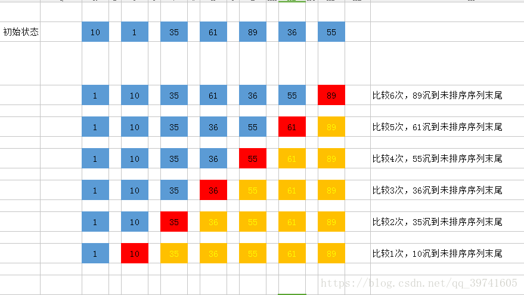

# 稳定的排序算法

> 假定在待排序的记录序列中，存在多个具有相同的关键字的记录，若经过排序，这些记录的相对次序保持不变，即在原序列中，r[i]=r[j]，且r[i]在r[j]之前，而在排序后的序列中，r[i]仍在r[j]之前，则称这种排序算法是稳定的；否则称为不稳定的。

> 对于稳定的排序算法，必须对算法进行分析从而得到稳定的特性

## 冒泡排序

+ 原理：比较两个相邻的元素，将值大的元素交换到右边
+ 思路：依次比较相邻的两个数，将比较小的数放在前面，比较大的数放在后面。
   + 第一次比较：首先比较第一和第二个数，将小数放在前面，将大数放在后面。
   + 比较第2和第3个数，将小数 放在前面，大数放在后面。
   + 如此继续，知道比较到最后的两个数，将小数放在前面，大数放在后面，重复步骤，直至全部排序完成
   + 在上面一趟比较完成后，最后一个数一定是数组中最大的一个数，所以在比较第二趟的时候，最后一个数是不参加比较的。
   + 在第二趟比较完成后，倒数第二个数也一定是数组中倒数第二大数，所以在第三趟的比较中，最后两个数是不参与比较的。
   + 依次类推，每一趟比较次数减少依次



+ 算法分析
   + 由此可见：N个数字要排序完成，总共进行N-1趟排序，每i趟的排序次数为(N-i)次，所以可以用双重循环语句，外层控制循环多少趟，内层控制每一趟的循环次数
   + 冒泡排序的优点：每进行一趟排序，就会少比较一次，因为每进行一趟排序都会找出一个较大值。如上例：第一趟比较之后，排在最后的一个数一定是最大的一个数，第二趟排序的时候，只需要比较除了最后一个数以外的其他的数，同样也能找出一个最大的数排在参与第二趟比较的数后面，第三趟比较的时候，只需要比较除了最后两个数以外的其他的数，以此类推……也就是说，没进行一趟比较，每一趟少比较一次，一定程度上减少了算法的量。
   + 时间复杂度：
      + 如果我们的数据正序，只需要走一趟即可完成排序。所需的比较次数C和记录移动次数M均达到最小值，即：Cmin=n-1;Mmin=0;所以，冒泡排序最好的时间复杂度为O(n)。
      + 如果很不幸我们的数据是反序的，则需要进行n-1趟排序。每趟排序要进行n-i次比较(1≤i≤n-1)，且每次比较都必须移动记录三次来达到交换记录位置。在这种情况下，比较和移动次数均达到最大值：

+ 综上所述：冒泡排序总的平均时间复杂度为：O(n^2) ,时间复杂度和数据状况无关。

```java
import java.util.Arrays;
//算法的最终时间复杂度为n^2
public class BubbleSort {
    public static void main(String[] args) {
        int testTime=500000;
        int size = 10;
        int value=100;
        boolean succeed = true;
        for(int i = 0 ;i<testTime;i++){
            int[] arr1 = generateRandomArray(size,value);
            int[] arr2 = copyArray(arr1);
            int[] arr3= copyArray(arr1);
            bubbleSort(arr1);
            rightMethod(arr2);
            if(!isEqual(arr1,arr2)){
                succeed=false;
                printArray(arr3);
                break;
            }
        }
        System.out.println(succeed?"Nice":"Fucking fucked!");
        int[] arr= generateRandomArray(size,value);
        printArray(arr);
        bubbleSort(arr);
        printArray(arr);
    }
    //产生一个随机数组，数组的长度和值都是随机的，
    public static  int[] generateRandomArray(int size,int value){
        //在java中，Math.random() ->double(0,1)
        //(int)((size+1)*Math.random())--->产生的是[0,size]之间的整数
        //生成长度随机的数组，数组的最大长度是size的长度
        int[] arr = new int[(int)((size+1)*Math.random())];
        for(int i = 0 ;i<arr.length;i++){
            //针对数组中的每个值都可以随机一下，一个随机数减去另外一个随机数，可能产生正数，也可能产生负数
            arr[i]=(int)((value+1)*Math.random())-(int)(value*Math.random());//值也可以是随机的
        }
        return arr;
    }
    //复制数组
    public static int[] copyArray(int[] arr){
        if(arr==null){
            return null;
        }
        int[] res = new int[arr.length];
        for(int i = 0 ;i<arr.length;i++){
            res[i]=arr[i]  ;
        }
        return res;
    }
    //绝对正确的方法,这个方法可以时间复杂度很差，但是要保证其准确性
    public static void rightMethod(int[] arr){
        Arrays.sort(arr);
    }
    //
    public static boolean isEqual(int[] arr1,int[] arr2){
        if(arr1==null&&arr2!=null||arr1!=null&&arr2==null){
            return false;
        }
        if (arr1==null&&arr2==null){
            return true;
        }
        if (arr1.length!=arr2.length){
            return false;
        }
        for(int i = 0;i<arr1.length;i++){
            if(arr1[i]!=arr2[i]){
                return false;
            }
        }
        return true;
    }
    //打印出数组
    public static void printArray(int[] arr){
        if(arr==null){
            return;
        }
        for(int i = 0 ;i<arr.length;i++){
            System.out.print(arr[i]+" ");
        }
        System.out.println();
    }

    //N个数字冒泡排序，总共要进行N-1趟比较，每趟的排序次数为(N-i)次比较
    public static void bubbleSort(int[] arr){
        //一定要记住判断边界条件，很多人不注意这些细节，面试官看到你的代码的时候都懒得往下看，你的代码哪个项目敢往里面加？
        if(arr==null||arr.length<2){
            return;
        }
        //需要进行arr.length趟比较

        for(int i = 0 ;i<arr.length-1;i++){
            //第i趟比较
            for(int j = 0 ;j<arr.length-i-1;j++){
                //开始进行比较，如果arr[j]比arr[j+1]的值大，那就交换位置
                if(arr[j]>arr[j+1]){
                    int temp=arr[j];
                    arr[j]=arr[j+1];
                    arr[j+1]=temp;
                }
            }

        }
//        System.out.println("最终得出的数组为：");
//        for (int k =0 ; k < arr.length;k++){
//            System.out.print(arr[k]+" ");
//        }
    }

    //生成一个对数器。产生一个随机样本的数组，数组的长度和值都是随机的
    //size是生成数组的最大长度
//    public static int[] generateRandomArray(int size,int value){
//        //生成长度随机的数组
//        int[] arr = new int[(int)((size+1)*Math.random())];
//        for(int i = 0 ;i<arr.length;i++){
//            arr[i]=(int)((value+1)*Math.random())-(int)(value*Math.random());
//        }
//        return arr;
//    }

    //for test
    public static  void rightMathods(int[] arr){
        //调用系统调用的函数来进行验证
        Arrays.sort(arr);
    }


}
```


## 插入排序

## 归并排序

## 基数排序

## 参考博客

+ https://www.cnblogs.com/codingmylife/archive/2012/10/21/2732980.html