# 线性表

## LinkedList（链式存储）

经典的双链表结构, 适用于乱序插入, 删除. 指定序列操作则性能不如ArrayList, 这也是其数据结构决定的.

+ add

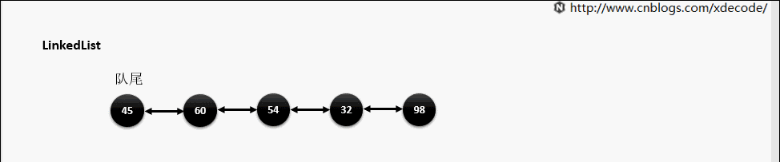

+ remove

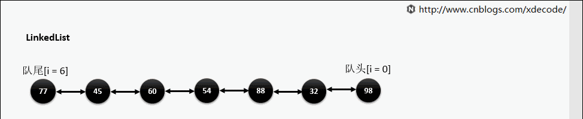

+ get

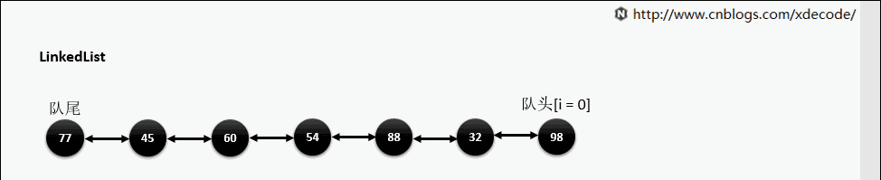

## ArrayList（顺序存储）

+ add

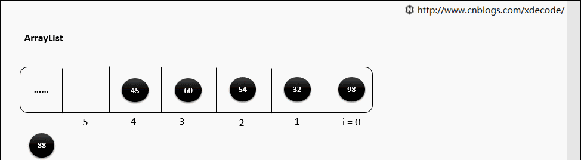

+ remove

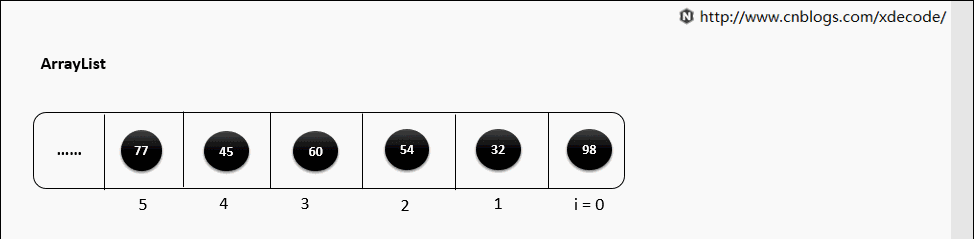

+ 扩容

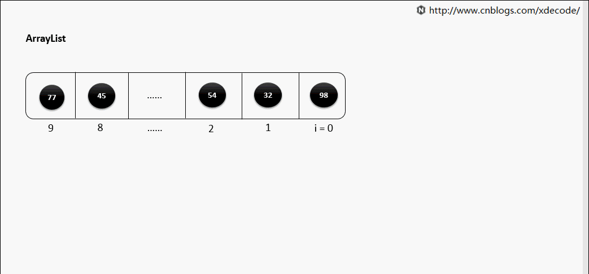

# 栈

## Stack

+ push

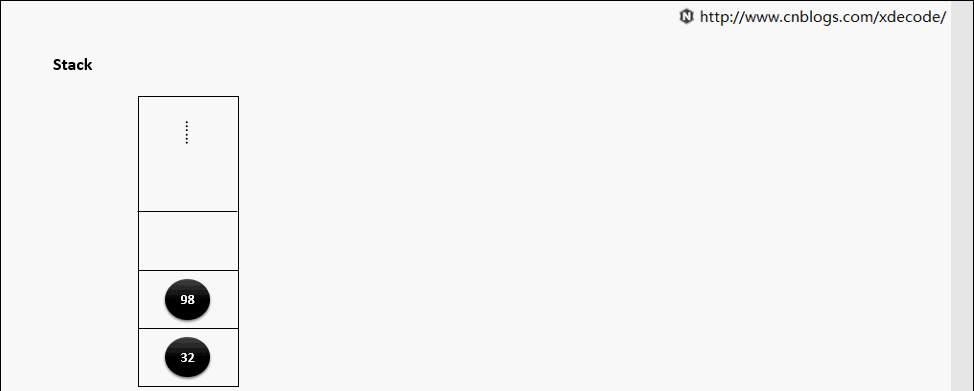

+ pop

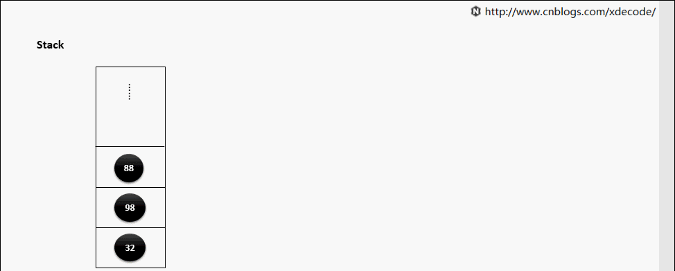

# 队列

## ArrayBlockingQueue

+ put

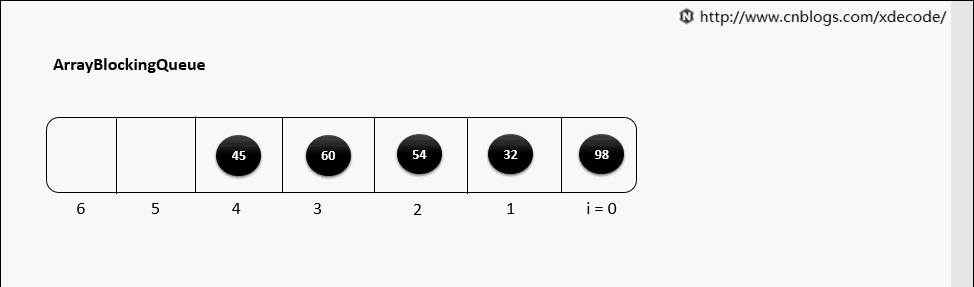

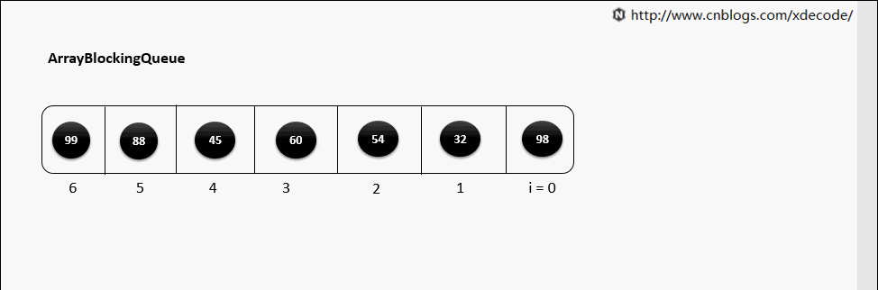

+ take

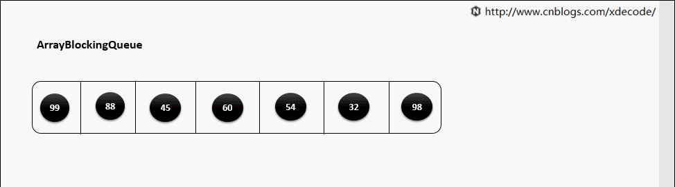

# 哈希表

## HashMap

+ put（元素hash值不相同）

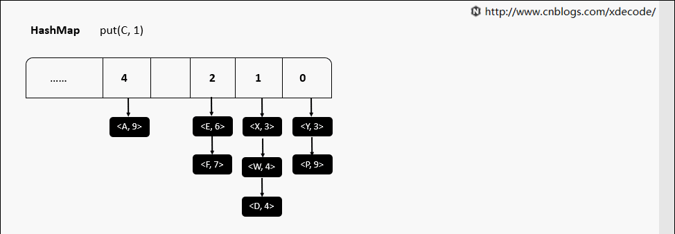

+ put（hash值相同）

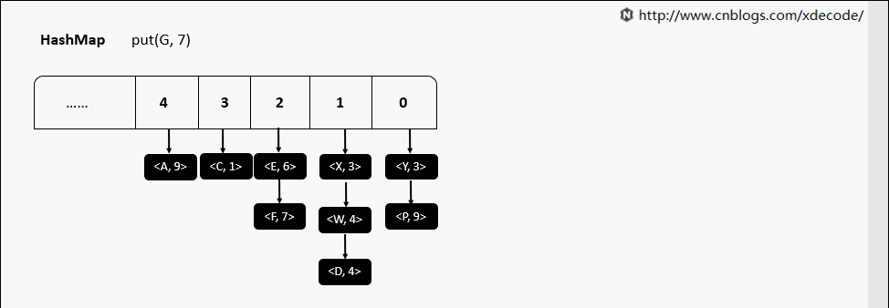

+ resize 动态扩容

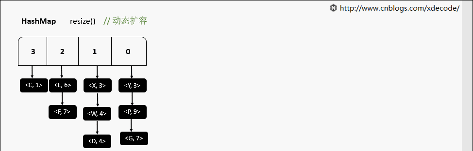

## LinkedHashMap

+ put

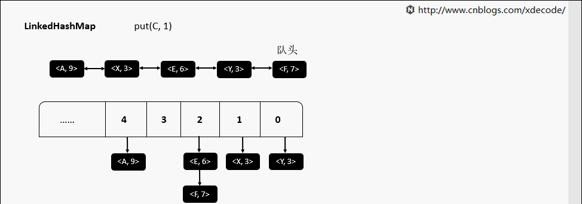

+ get

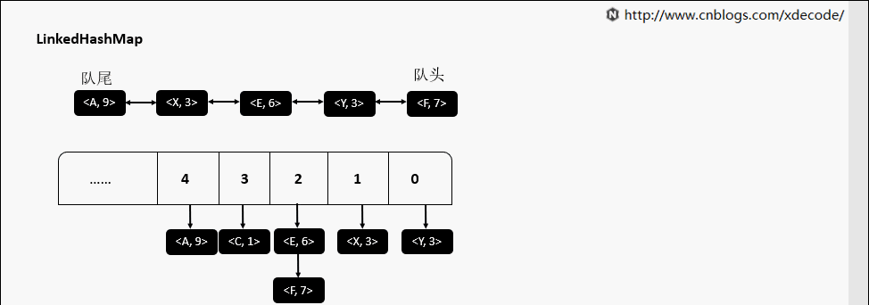

+ removeEldestEntry（删除最古老的元素）

# 参考博客
+ 动画来源：https://www.cnblogs.com/xdecode/p/9321848.html