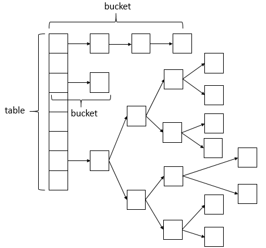
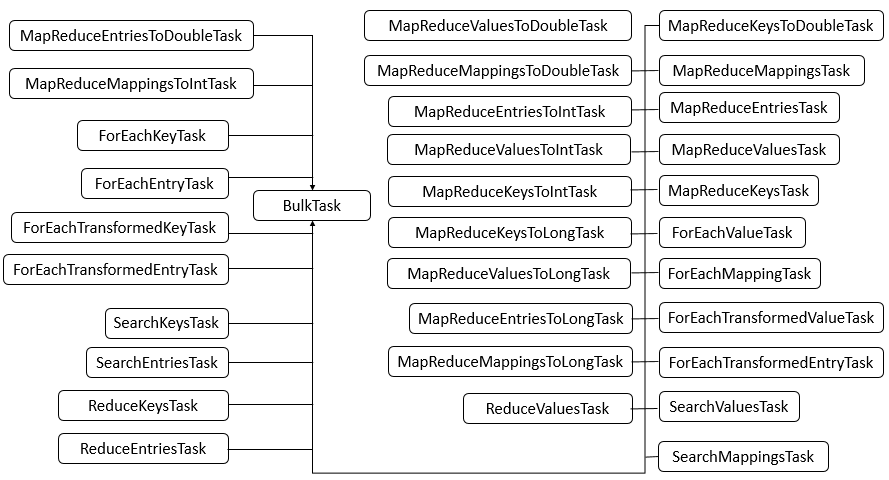

# ConcurrentHashMap源码分析

---

## 数据结构



+ ConcurrentHashMap相比HashMap而言，是多线程安全的，其底层数据与HashMap的数据结构相同
+ 说明：ConcurrentHashMap的数据结构（数组+链表+红黑树），桶中的结构可能是链表，也可能是红黑树，红黑树是为了提高查找效率。

## 继承关系

```java
public class ConcurrentHashMap<K,V> extends AbstractMap<K,V> implements ConcurrentMap<K,V>, Serializable
```

   + 说明：ConcurrentHashMap继承了AbstractMap抽象类，该抽象类定义了一些基本操作，同时，也实现了ConcurrentMap接口，ConcurrentMap接口也定义了一系列操作，实现了Serializable接口表示ConcurrentHashMap可以被序列化。

## 内部类


---


		
+ 说明：可以看到，ConcurrentHashMap的内部类非常的庞大，第二个图是在JDK1.8下增加的类，下面对其中主要的内部类进行分析和讲解。
+ Node类 （核心内部类）
   + Node类主要用于存储具体键值对，其子类有ForwardingNode、ReservationNode、TreeNode和TreeBin四个子类。四个子类具体的代码在之后的具体例子中进行分析讲解。

```java
    /**
     * Key-value entry.  This class is never exported out as a
     * user-mutable Map.Entry (i.e., one supporting setValue; see
     * MapEntry below), but can be used for read-only traversals used
     * in bulk tasks.  Subclasses of Node with a negative hash field
     * are special, and contain null keys and values (but are never
     * exported).  Otherwise, keys and vals are never null.
     */
    static class Node<K,V> implements Map.Entry<K,V> {
        final int hash;
        final K key;
        volatile V val;
        volatile Node<K,V> next;

        Node(int hash, K key, V val, Node<K,V> next) {
            this.hash = hash;
            this.key = key;
            this.val = val;
            this.next = next;
        }

        public final K getKey()       { return key; }
        public final V getValue()     { return val; }
        public final int hashCode()   { return key.hashCode() ^ val.hashCode(); }
        public final String toString(){ return key + "=" + val; }
        public final V setValue(V value) {
            throw new UnsupportedOperationException();
        }

        public final boolean equals(Object o) {
            Object k, v, u; Map.Entry<?,?> e;
            return ((o instanceof Map.Entry) &&
                    (k = (e = (Map.Entry<?,?>)o).getKey()) != null &&
                    (v = e.getValue()) != null &&
                    (k == key || k.equals(key)) &&
                    (v == (u = val) || v.equals(u)));
        }

        /**
         * Virtualized support for map.get(); overridden in subclasses.
         */
        Node<K,V> find(int h, Object k) {
            Node<K,V> e = this;
            if (k != null) {
                do {
                    K ek;
                    if (e.hash == h &&
                        ((ek = e.key) == k || (ek != null && k.equals(ek))))
                        return e;
                } while ((e = e.next) != null);
            }
            return null;
        }
    }
```
			
+ Traverser类
   + Traverser类主要用于遍历操作，其子类有BaseIterator、KeySpliterator、ValueSpliterator、EntrySpliterator四个类，BaseIterator用于遍历操作。KeySplitertor、ValueSpliterator、EntrySpliterator则用于键、值、键值对的划分。
+ CollectionView类
   + CollectionView抽象类主要定义了视图操作，其子类KeySetView、ValueSetView、EntrySetView分别表示键视图、值视图、键值对视图。对视图均可以进行操作。
+ Segment类
   + Segment类在JDK1.8中与之前的版本的JDK作用存在很大的差别，JDK1.8下，其在普通的ConcurrentHashMap操作中已经没有失效，其在序列化与反序列化的时候会发挥作用。
   + 1.7与1.8有区别
+ CounterCell类
   + CounterCell类主要用于对baseCount的计数。

## 类属性

```java
public class ConcurrentHashMap<K,V> extends AbstractMap<K,V>
    implements ConcurrentMap<K,V>, Serializable {
    private static final long serialVersionUID = 7249069246763182397L;
    // 表的最大容量
    private static final int MAXIMUM_CAPACITY = 1 << 30;
    // 默认表的大小
    private static final int DEFAULT_CAPACITY = 16;
    // 最大数组大小
    static final int MAX_ARRAY_SIZE = Integer.MAX_VALUE - 8;
    // 默认并发数
    private static final int DEFAULT_CONCURRENCY_LEVEL = 16;
    // 装载因子
    private static final float LOAD_FACTOR = 0.75f;
    // 转化为红黑树的阈值
    static final int TREEIFY_THRESHOLD = 8;
    // 由红黑树转化为链表的阈值
    static final int UNTREEIFY_THRESHOLD = 6;
    // 转化为红黑树的表的最小容量
    static final int MIN_TREEIFY_CAPACITY = 64;
    // 每次进行转移的最小值
    private static final int MIN_TRANSFER_STRIDE = 16;
    // 生成sizeCtl所使用的bit位数
    private static int RESIZE_STAMP_BITS = 16;
    // 进行扩容所允许的最大线程数
    private static final int MAX_RESIZERS = (1 << (32 - RESIZE_STAMP_BITS)) - 1;
    // 记录sizeCtl中的大小所需要进行的偏移位数
    private static final int RESIZE_STAMP_SHIFT = 32 - RESIZE_STAMP_BITS;    
    // 一系列的标识
    static final int MOVED     = -1; // hash for forwarding nodes
    static final int TREEBIN   = -2; // hash for roots of trees
    static final int RESERVED  = -3; // hash for transient reservations
    static final int HASH_BITS = 0x7fffffff; // usable bits of normal node hash
    // 
    /** Number of CPUS, to place bounds on some sizings */
    // 获取可用的CPU个数
    static final int NCPU = Runtime.getRuntime().availableProcessors();
    // 
    /** For serialization compatibility. */
    // 进行序列化的属性
    private static final ObjectStreamField[] serialPersistentFields = {
        new ObjectStreamField("segments", Segment[].class),
        new ObjectStreamField("segmentMask", Integer.TYPE),
        new ObjectStreamField("segmentShift", Integer.TYPE)
    };
    
    // 表
    transient volatile Node<K,V>[] table;
    // 下一个表
    private transient volatile Node<K,V>[] nextTable;
    //
    /**
     * Base counter value, used mainly when there is no contention,
     * but also as a fallback during table initialization
     * races. Updated via CAS.
     */
    // 基本计数
    private transient volatile long baseCount;
    //
    /**
     * Table initialization and resizing control.  When negative, the
     * table is being initialized or resized: -1 for initialization,
     * else -(1 + the number of active resizing threads).  Otherwise,
     * when table is null, holds the initial table size to use upon
     * creation, or 0 for default. After initialization, holds the
     * next element count value upon which to resize the table.
     */
    // 对表初始化和扩容控制
        //  来看下注释，当sizeCtl小于0说明有多个线程正则等待扩容结果，参考transfer函数
        // sizeCtl等于0是默认值，大于0是扩容的阀值
    private transient volatile int sizeCtl;
    
    /**
     * The next table index (plus one) to split while resizing.
     */
    // 扩容下另一个表的索引
    private transient volatile int transferIndex;

    /**
     * Spinlock (locked via CAS) used when resizing and/or creating CounterCells.
     */
    // 旋转锁
    private transient volatile int cellsBusy;

    /**
     * Table of counter cells. When non-null, size is a power of 2.
     */
    // counterCell表
    private transient volatile CounterCell[] counterCells;

    // views
    // 视图
    private transient KeySetView<K,V> keySet;
    private transient ValuesView<K,V> values;
    private transient EntrySetView<K,V> entrySet;
    
    // Unsafe mechanics
    private static final sun.misc.Unsafe U;
    private static final long SIZECTL;
    private static final long TRANSFERINDEX;
    private static final long BASECOUNT;
    private static final long CELLSBUSY;
    private static final long CELLVALUE;
    private static final long ABASE;
    private static final int ASHIFT;

    static {
        try {
            U = sun.misc.Unsafe.getUnsafe();
            Class<?> k = ConcurrentHashMap.class;
            SIZECTL = U.objectFieldOffset
                (k.getDeclaredField("sizeCtl"));
            TRANSFERINDEX = U.objectFieldOffset
                (k.getDeclaredField("transferIndex"));
            BASECOUNT = U.objectFieldOffset
                (k.getDeclaredField("baseCount"));
            CELLSBUSY = U.objectFieldOffset
                (k.getDeclaredField("cellsBusy"));
            Class<?> ck = CounterCell.class;
            CELLVALUE = U.objectFieldOffset
                (ck.getDeclaredField("value"));
            Class<?> ak = Node[].class;
            ABASE = U.arrayBaseOffset(ak);
            int scale = U.arrayIndexScale(ak);
            if ((scale & (scale - 1)) != 0)
                throw new Error("data type scale not a power of two");
            ASHIFT = 31 - Integer.numberOfLeadingZeros(scale);
        } catch (Exception e) {
            throw new Error(e);
        }
    }
}
```
+ 说明：ConcurrentHashMap的属性很多，其中不少属性在HashMap中就已经介绍过，而对于ConcurrentHashMap而言，添加了Unsafe实例，主要用于反射获取对象相应的字段。

## 构造函数

+ ConcurrentHashMap()
   + 说明：该构造函数用于创建一个带有默认初始容量 (16)、加载因子 (0.75) 和 concurrencyLevel (16) 的新的空映射。
```java
    /**
     * Creates a new, empty map with the default initial table size (16).
     */
    public ConcurrentHashMap() {
    }
```
+ ConcurrentHashMap(int initialCapacity)
   + 说明：该构造函数用于创建一个带有指定初始容量、默认加载因子 (0.75) 和 concurrencyLevel (16) 的新的空映射。
```java
    /**
     * Creates a new, empty map with an initial table size
     * accommodating the specified number of elements without the need
     * to dynamically resize.
     *
     * @param initialCapacity The implementation performs internal
     * sizing to accommodate this many elements.
     * @throws IllegalArgumentException if the initial capacity of
     * elements is negative
     */
    public ConcurrentHashMap(int initialCapacity) {
        if (initialCapacity < 0) // 判断初始容量
            throw new IllegalArgumentException();
        int cap = ((initialCapacity >= (MAXIMUM_CAPACITY >>> 1)) ?
                   MAXIMUM_CAPACITY :
                   // 找到最接近该容量的2的幂次方数
                   tableSizeFor(initialCapacity + (initialCapacity >>> 1) + 1));
        // 初始化
        this.sizeCtl = cap;
    }
    
    /**
     * 将输入的参数调整为2的倍数
     * See Hackers Delight, sec 3.2
     */
    private static final int tableSizeFor(int c) {
        int n = c - 1;
        n |= n >>> 1;
        n |= n >>> 2;
        n |= n >>> 4;
        n |= n >>> 8;
        n |= n >>> 16;
        return (n < 0) ? 1 : (n >= MAXIMUM_CAPACITY) ? MAXIMUM_CAPACITY : n + 1;
    }
```
+ ConcurrentHashMap(Map<? extends K, ? extends V> m)
   + 说明：该构造函数用于构造一个与给定映射具有相同映射关系的新映射。
```java
    /**
     * Creates a new map with the same mappings as the given map.
     *
     * @param m the map
     */
    public ConcurrentHashMap(Map<? extends K, ? extends V> m) {
        // DEFAULT_CAPACITY = 16
        this.sizeCtl = DEFAULT_CAPACITY;
        putAll(m);
    }
```
+ ConcurrentHashMap(int initialCapacity, float loadFactor)
    说明：该构造函数用于创建一个带有指定初始容量、加载因子和默认 concurrencyLevel (1) 的新的空映射。
```java
    /**
     * Creates a new, empty map with an initial table size based on
     * the given number of elements ({@code initialCapacity}) and
     * initial table density ({@code loadFactor}).
     *
     * @param initialCapacity the initial capacity. The implementation
     * performs internal sizing to accommodate this many elements,
     * given the specified load factor.
     * @param loadFactor the load factor (table density) for
     * establishing the initial table size
     * @throws IllegalArgumentException if the initial capacity of
     * elements is negative or the load factor is nonpositive
     *
     * @since 1.6
     */
    public ConcurrentHashMap(int initialCapacity, float loadFactor) {
        this(initialCapacity, loadFactor, 1);
    }
```
+ ConcurrentHashMap(int initialCapacity, float loadFactor, int concurrencyLevel)
   + 说明：该构造函数用于创建一个带有指定初始容量、加载因子和并发级别的新的空映射。
```java
    /**
     * Creates a new, empty map with an initial table size based on
     * the given number of elements ({@code initialCapacity}), table
     * density ({@code loadFactor}), and number of concurrently
     * updating threads ({@code concurrencyLevel}).
     *
     * @param initialCapacity the initial capacity. The implementation
     * performs internal sizing to accommodate this many elements,
     * given the specified load factor.
     * @param loadFactor the load factor (table density) for
     * establishing the initial table size
     * @param concurrencyLevel the estimated number of concurrently
     * updating threads. The implementation may use this value as
     * a sizing hint.
     * @throws IllegalArgumentException if the initial capacity is
     * negative or the load factor or concurrencyLevel are
     * nonpositive
     */
    public ConcurrentHashMap(int initialCapacity,
                             float loadFactor, int concurrencyLevel) {
        if (!(loadFactor > 0.0f) || initialCapacity < 0 || concurrencyLevel <= 0)
            throw new IllegalArgumentException();
        if (initialCapacity < concurrencyLevel)   // Use at least as many bins
            initialCapacity = concurrencyLevel;   // as estimated threads
        long size = (long)(1.0 + (long)initialCapacity / loadFactor);
        int cap = (size >= (long)MAXIMUM_CAPACITY) ?
            MAXIMUM_CAPACITY : tableSizeFor((int)size);
        this.sizeCtl = cap;
    }
```
## 核心方法
+ putVal(K key, V value, boolean onlyIfAbsent)
