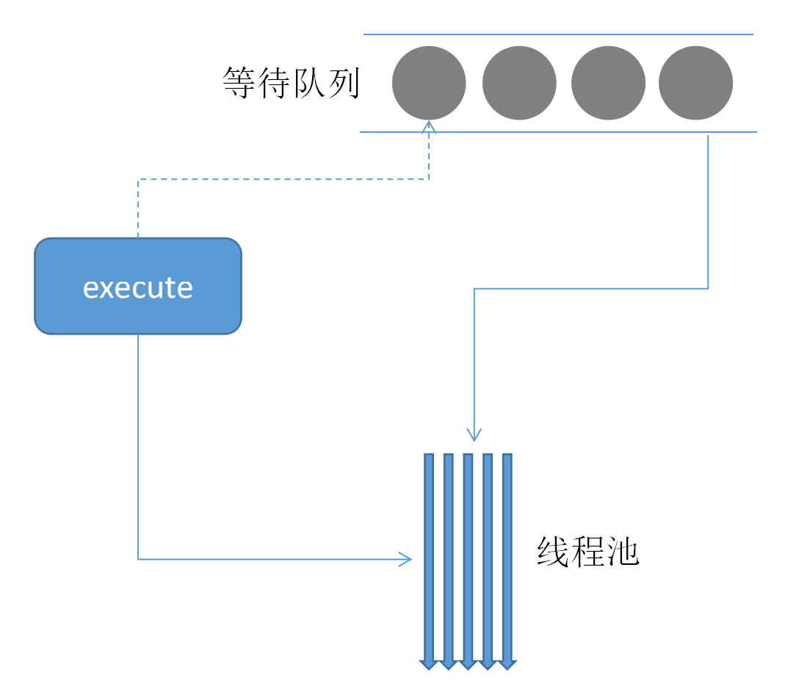
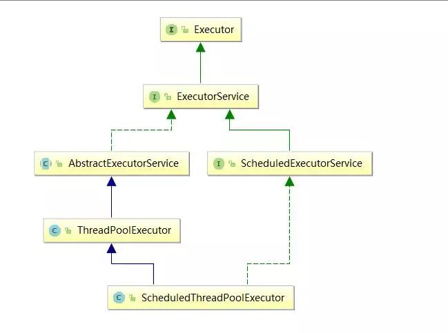
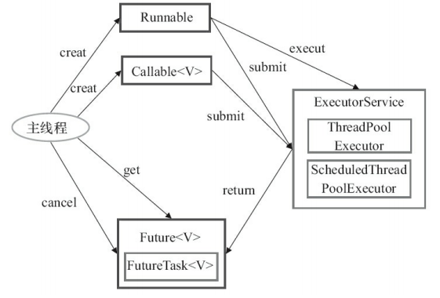
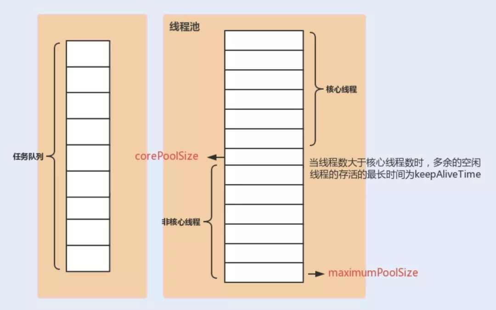
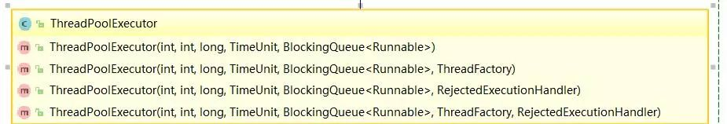
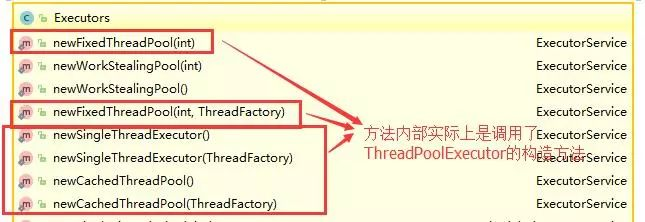
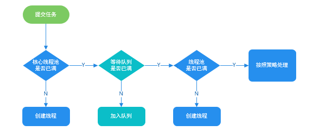

## 线程池的好处

+ 降低资源消耗。通过重复利用已创建的线程降低线程创建和销毁造成的消耗。
+ 提高响应速度。当任务到达时，任务可以不需要的等到线程创建就能立即执行。
+ 提高线程的可管理性。线程是稀缺资源，如果无限制的创建，不仅会消耗系统资源，还会降低系统的稳定性，使用线程池可以进行统一的分配，调优和监控。

## 线程池基本结构

如下图所示。用户通过使用线程池的execute方法将Runnable提交到线程池中进行执行。当线程池中的线程都很忙的时候，这个新加入的 Runnable 就会被放到等待队列。当线程空闲下来的时候，就会去等待队列里查看是否还有排队等待的任务，如果有，就会队列中取出任务并继续执行。如果没有，线程就会进入休眠。



## Executor框架

### 简介

Executor 框架是 Java5 之后引进的，在 Java 5 之后，通过 Executor 来启动线程比使用 Thread 的 start 方法更好，除了更易管理，效率更好（用线程池实现，节约开销）外，还有关键的一点：有助于避免 this 逃逸问题。

> 补充：this 逃逸是指在构造函数返回之前其他线程就持有该对象的引用. 调用尚未构造完全的对象的方法可能引发令人疑惑的错误。

Executor 框架不仅包括了线程池的管理，还提供了线程工厂、队列以及拒绝策略等，Executor 框架让并发编程变得更加简单。

### Executor 框架结构

主要由三大部分组成

#### 任务(Runnable /Callable)

执行任务需要实现的 `Runnable接口` 或 `Callable接口`。`Runnable接口` 或 `Callable接口` 实现类都可以被 `ThreadPoolExecutor` 或 `ScheduledThreadPoolExecutor` 执行。

#### 任务的执行(Executor)

如下图所示，包括任务执行机制的核心接口 `Executor` ，以及继承自 `Executor` 接口的 `ExecutorService` 接口。



`ThreadPoolExecutor` 和 `ScheduledThreadPoolExecutor` 这两个关键类实现了 ExecutorService 接口。

这里提了很多底层的类关系，但是，实际上我们需要更多关注的是 `ThreadPoolExecutor` 这个类，这个类在我们实际使用线程池的过程中，使用频率还是非常高的。

> 注意： 通过查看 `ScheduledThreadPoolExecutor` 源代码我们发现 `ScheduledThreadPoolExecutor` 实际上是继承了 `ThreadPoolExecutor` 并实现了 `ScheduledExecutorService` ，而 `ScheduledExecutorService` 又实现了 `ExecutorService`，正如我们下面给出的类关系图显示的一样。

`ThreadPoolExecutor` 类描述:

```java
//AbstractExecutorService实现了ExecutorService接口
public class ThreadPoolExecutor extends AbstractExecutorService
```

`ScheduledThreadPoolExecutor` 类描述:

```java
//ScheduledExecutorService实现了ExecutorService接口
public class ScheduledThreadPoolExecutor
        extends ThreadPoolExecutor
        implements ScheduledExecutorService
```

#### 异步计算的结果(Future)

`Future` 接口以及 `Future` 接口的实现类 ` FutureTask ` 类都可以代表异步计算的结果。

当我们把 `Runnable接口` 或 `Callable接口` 的实现类提交给 `ThreadPoolExecutor` 或 `ScheduledThreadPoolExecutor` 执行。（调用 `submit()` 方法时会返回一个 `FutureTask` 对象）

### Executor 框架的使用示意图



+ 主线程首先要创建实现 `Runnable` 或者 `Callable` 接口的任务对象。
+ 把创建完成的实现 `Runnable`/`Callable` 接口的对象直接交给 `ExecutorService` 执行: `ExecutorService.execute（Runnable command）`或者也可以把 `Runnable` `对象或Callable` 对象提交给 `ExecutorService` 执行（`ExecutorService.submit（Runnable task）或 ExecutorService.submit（Callable <T> task）`）。
+ 如果执行 `ExecutorService.submit（…）`，`ExecutorService` 将返回一个实现 `Future` 接口的对象（我们刚刚也提到过了执行 `execute()`方法和 `submit()`方法的区别，`submit()`会返回一个 `FutureTask` 对象）。由于 `FutureTask` 实现了 `Runnable`，我们也可以创建 `FutureTask`，然后直接交给 `ExecutorService` 执行。
+ 最后，主线程可以执行 `FutureTask.get()` 方法来等待任务执行完成。主线程也可以执行 `FutureTask.cancel（boolean mayInterruptIfRunning）`来取消此任务的执行。

## ThreadPoolExecutor 类简单介绍(重要)

线程池实现类 `ThreadPoolExecutor` 是 `Executor` 框架最核心的类。

### ThreadPoolExecutor 类分析

`ThreadPoolExecutor` 类中提供的四个构造方法。我们来看最长的那个，其余三个都是在这个构造方法的基础上产生（其他几个构造方法说白点都是给定某些默认参数的构造方法比如默认制定拒绝策略是什么），这里就不贴代码讲了，比较简单。

```java
     /**
     * 用给定的初始参数创建一个新的ThreadPoolExecutor。
     */
    public ThreadPoolExecutor(int corePoolSize,//线程池的核心线程数量
                              int maximumPoolSize,//线程池的最大线程数
                              long keepAliveTime,//当线程数大于核心线程数时，多余的空闲线程存活的最长时间
                              TimeUnit unit,//时间单位
                              BlockingQueue<Runnable> workQueue,//任务队列，用来储存等待执行任务的队列
                              ThreadFactory threadFactory,//线程工厂，用来创建线程，一般默认即可
                              RejectedExecutionHandler handler//拒绝策略，当提交的任务过多而不能及时处理时，我们可以定制策略来处理任务
                               ) {
        if (corePoolSize < 0 ||
            maximumPoolSize <= 0 ||
            maximumPoolSize < corePoolSize ||
            keepAliveTime < 0)
            throw new IllegalArgumentException();
        if (workQueue == null || threadFactory == null || handler == null)
            throw new NullPointerException();
        this.corePoolSize = corePoolSize;
        this.maximumPoolSize = maximumPoolSize;
        this.workQueue = workQueue;
        this.keepAliveTime = unit.toNanos(keepAliveTime);
        this.threadFactory = threadFactory;
        this.handler = handler;
    }
```

下面这些对创建参数非常重要，在后面使用线程池的过程中你一定会用到！所以，务必拿着小本本记清楚。

`ThreadPoolExecutor` 3 个最重要的参数：

+ `int corePoolSize` : 核心线程数线程数定义了最小可以同时运行的线程数量。
+ `int maximumPoolSize` : 当队列中存放的任务达到队列容量的时候，当前可以同时运行的线程数量变为最大线程数。
+ `BlockingQueue<Runnable> workQueue`: 当新任务来的时候会先判断当前运行的线程数量是否达到核心线程数，如果达到的话，信任就会被存放在队列中。

`ThreadPoolExecutor` 其他常见参数:

+ `long keepAliveTime` : 当线程池中的线程数量大于 `corePoolSize` 的时候，如果这时没有新的任务提交，核心线程外的线程不会立即销毁，而是会等待，直到等待的时间超过了 `keepAliveTime` 才会被回收销毁；
+ `TimeUnit unit` : `keepAliveTime` 参数的时间单位。
+ `ThreadFactory threadFactory` : `executor` 创建新线程的时候会用到。
+ `RejectedExecutionHandler handler` :饱和策略。关于饱和策略下面单独介绍一下。
下面这张图可以加深你对线程池中各个参数的相互关系的理解（图片来源：《Java性能调优实战》）：



#### ThreadPoolExecutor 拒绝策略定义:

如果当前同时运行的线程数量达到最大线程数量并且队列也已经被放满了任时，`ThreadPoolTaskExecutor` 定义一些策略:

`RejectedExecutionHandler` 是一个接口：

```java
// 里面只有一个方法。当要创建的线程数量大于线程池的最大线程数的时候，新的任务就会被拒绝，就会调用这个接口里的这个方法。
// 可以自己实现这个接口，实现对这些超出数量的任务的处理。
public interface RejectedExecutionHandler {
    void rejectedExecution(Runnable r, ThreadPoolExecutor executor);
}
```

##### AbortPolicy

   + 直接抛出 `RejectedExecutionException` 来拒绝新任务的处理
   + 源码
   ```java
    /**
     * A handler for rejected tasks that throws a
     * {@code RejectedExecutionException}.
     */
    public static class AbortPolicy implements RejectedExecutionHandler {
        /**
         * Creates an {@code AbortPolicy}.
         */
        public AbortPolicy() { }

        /**
         * Always throws RejectedExecutionException.
         *
         * @param r the runnable task requested to be executed
         * @param e the executor attempting to execute this task
         * @throws RejectedExecutionException always
         */
        public void rejectedExecution(Runnable r, ThreadPoolExecutor e) {
            throw new RejectedExecutionException("Task " + r.toString() +
                                                 " rejected from " +
                                                 e.toString());
        }
    }
    ```
    + 测试
    `MyThread`
    ```java
    static class MyThread implements Runnable {
        String name;
        public MyThread(String name) {
            this.name = name;
        }
        @Override
        public void run() {
            try {
                Thread.sleep(2000);
            } catch (InterruptedException e) {
                e.printStackTrace();
            }
            System.out.println("线程:"+Thread.currentThread().getName() +" 执行:"+name +"  run");
        }
    }
    ```
    `executor`
    ```java
    ThreadPoolExecutor executor = new ThreadPoolExecutor(1, 2, 0, 
        TimeUnit.MICROSECONDS, 
        new LinkedBlockingDeque<Runnable>(2), 
        new ThreadPoolExecutor.AbortPolicy());
    ```
    `main方法`
    ```java
    for (int i = 0; i < 6; i++) {
        System.out.println("添加第"+i+"个任务");
        executor.execute(new MyThread("线程"+i));
        Iterator iterator = executor.getQueue().iterator();
        while (iterator.hasNext()){
            MyThread thread = (MyThread) iterator.next();
            System.out.println("列表："+thread.name);
        }
    }
    ```
    + 测试结果
    ```log
    添加第0个任务
    添加第1个任务
    列表：线程1
    添加第2个任务
    列表：线程1
    列表：线程2
    添加第3个任务
    列表：线程1
    列表：线程2
    添加第4个任务
    Exception in thread "main" java.util.concurrent.RejectedExecutionException: Task Test$MyThread@5e2de80c rejected from java.util.concurrent.ThreadPoolExecutor@1d44bcfa[Running, pool size = 2, active threads = 2, queued tasks = 2, completed tasks = 0]
        at java.util.concurrent.ThreadPoolExecutor$AbortPolicy.rejectedExecution(ThreadPoolExecutor.java:2063)
        at java.util.concurrent.ThreadPoolExecutor.reject(ThreadPoolExecutor.java:830)
        at java.util.concurrent.ThreadPoolExecutor.execute(ThreadPoolExecutor.java:1379)
        at Test.main(Test.java:41)
    线程:pool-1-thread-1 执行:线程0  run
    线程:pool-1-thread-2 执行:线程3  run
    线程:pool-1-thread-1 执行:线程1  run
    线程:pool-1-thread-2 执行:线程2  run
    ```
    + 测试结果分析
       + 添加第一个任务时，直接执行，任务列表为空。
       + 添加第二个任务时，因为采用的LinkedBlockingDeque，，并且核心线程正在执行任务，所以会将第二个任务放在队列中，队列中有 线程2.
       + 添加第三个任务时，也一样会放在队列中，队列中有 线程2，线程3.
       + 添加第四个任务时，因为核心任务还在运行，而且任务队列已经满了，所以胡直接创建新线程执行第四个任务，。这时线程池中一共就有两个线程在运行了，达到了最大线程数。任务队列中还是有线程2， 线程3.
       + 添加第五个任务时，再也没有地方能存放和执行这个任务了，就会被线程池拒绝添加，执行拒绝策略的rejectedExecution方法，这里就是执行AbortPolicy的rejectedExecution方法直接抛出异常。
       + 最终，只有四个线程能完成运行。后面的都被拒绝了。


##### CallerRunsPolicy

   + 调用执行自己的线程运行任务。但是这种策略会降低对于新任务提交速度，影响程序的整体性能。另外，这个策略喜欢增加队列容量。如果您的应用程序可以承受此延迟并且你不能任务丢弃任何一个任务请求的话，你可以选择这个策略。
   + 源码
   ```java
   /**
     * A handler for rejected tasks that runs the rejected task
     * directly in the calling thread of the {@code execute} method,
     * unless the executor has been shut down, in which case the task
     * is discarded.
     */
    public static class CallerRunsPolicy implements RejectedExecutionHandler {
        /**
         * Creates a {@code CallerRunsPolicy}.
         */
        public CallerRunsPolicy() { }

        /**
         * Executes task r in the caller's thread, unless the executor
         * has been shut down, in which case the task is discarded.
         *
         * @param r the runnable task requested to be executed
         * @param e the executor attempting to execute this task
         */
        public void rejectedExecution(Runnable r, ThreadPoolExecutor e) {
            if (!e.isShutdown()) {
                r.run();
            }
        }
    }
    ```
    + 测试
    ```java
    ThreadPoolExecutor executor = new ThreadPoolExecutor(1, 2, 30,
            TimeUnit.SECONDS,
            new LinkedBlockingDeque<Runnable>(2),
            new ThreadPoolExecutor.CallerRunsPolicy());
    ```
    + 测试结果
    ```log
    添加第0个任务
    添加第1个任务
    列表：线程1
    添加第2个任务
    列表：线程1
    列表：线程2
    添加第3个任务
    列表：线程1
    列表：线程2
    添加第4个任务
    线程:pool-1-thread-1 执行:线程0  run
    线程:pool-1-thread-2 执行:线程3  run
    线程:main 执行:线程4  run
    添加第5个任务
    列表：线程5
    线程:pool-1-thread-1 执行:线程1  run
    线程:pool-1-thread-2 执行:线程2  run
    线程:pool-1-thread-1 执行:线程5  run
    ```
    + 测试结果分析
       + 注意在添加第五个任务，任务5 的时候，同样被线程池拒绝了，因此执行了CallerRunsPolicy的rejectedExecution方法，这个方法直接执行任务的run方法。因此可以看到任务5是在main线程中执行的。
       + 从中也可以看出，因为第五个任务在主线程中运行，所以主线程就被阻塞了，以至于当第五个任务执行完，添加第六个任务时，前面两个任务已经执行完了，有了空闲线程，因此线程6又可以添加到线程池中执行了。
       + 这个策略的缺点就是可能会阻塞主线程。

##### DiscardPolicy

   + 不处理新任务，直接丢弃掉，也不抛出任何异常
   + 源码
   ```java
   /**
     * A handler for rejected tasks that silently discards the
     * rejected task.
     */
    public static class DiscardPolicy implements RejectedExecutionHandler {
        /**
         * Creates a {@code DiscardPolicy}.
         */
        public DiscardPolicy() { }

        /**
         * Does nothing, which has the effect of discarding task r.
         *
         * @param r the runnable task requested to be executed
         * @param e the executor attempting to execute this task
         */
        public void rejectedExecution(Runnable r, ThreadPoolExecutor e) {
        }
    }
    ```
    + 测试
    ```java
    ThreadPoolExecutor executor = new ThreadPoolExecutor(1, 2, 30,
        TimeUnit.SECONDS,
        new LinkedBlockingDeque<Runnable>(2),
        new ThreadPoolExecutor.DiscardPolicy());
    ```
    + 测试结果
    ```log
    添加第0个任务
    添加第1个任务
    列表：线程1
    添加第2个任务
    列表：线程1
    列表：线程2
    添加第3个任务
    列表：线程1
    列表：线程2
    添加第4个任务
    列表：线程1
    列表：线程2
    添加第5个任务
    列表：线程1
    列表：线程2
    线程:pool-1-thread-2 执行:线程3  run
    线程:pool-1-thread-1 执行:线程0  run
    线程:pool-1-thread-2 执行:线程1  run
    线程:pool-1-thread-1 执行:线程2  run
    ```
    + 测试结果分析
       + 可以看到 后面添加的任务5和6根本不会执行，什么反应都没有，直接丢弃。

##### DiscardOldestPolicy

   + 当任务被拒绝添加时，会抛弃任务队列中最旧的任务也就是最先加入队列的，再把这个新任务添加进去。
   + 源码
   ```java
   /**
     * A handler for rejected tasks that discards the oldest unhandled
     * request and then retries {@code execute}, unless the executor
     * is shut down, in which case the task is discarded.
     */
    public static class DiscardOldestPolicy implements RejectedExecutionHandler {
        /**
         * Creates a {@code DiscardOldestPolicy} for the given executor.
         */
        public DiscardOldestPolicy() { }

        /**
         * Obtains and ignores the next task that the executor
         * would otherwise execute, if one is immediately available,
         * and then retries execution of task r, unless the executor
         * is shut down, in which case task r is instead discarded.
         *
         * @param r the runnable task requested to be executed
         * @param e the executor attempting to execute this task
         */
        public void rejectedExecution(Runnable r, ThreadPoolExecutor e) {
            if (!e.isShutdown()) {
                e.getQueue().poll();
                e.execute(r);
            }
        }
    }
    ```
    + 测试
    ```java
    ThreadPoolExecutor executor = new ThreadPoolExecutor(1, 2, 30,
            TimeUnit.SECONDS,
            new LinkedBlockingDeque<Runnable>(2),
            new ThreadPoolExecutor.DiscardOldestPolicy());
    ```
    + 测试结果
    ```log
    添加第0个任务
    添加第1个任务
    列表：线程1
    添加第2个任务
    列表：线程1
    列表：线程2
    添加第3个任务
    列表：线程1
    列表：线程2
    添加第4个任务
    列表：线程2
    列表：线程4
    添加第5个任务
    列表：线程4
    列表：线程5
    线程:pool-1-thread-1 执行:线程0  run
    线程:pool-1-thread-2 执行:线程3  run
    线程:pool-1-thread-1 执行:线程4  run
    线程:pool-1-thread-2 执行:线程5  run
    ```
    + 测试结果分析
       + 在添加第五个任务时，会被线程池拒绝。这时任务队列中有 任务2，任务3
       + 这时，拒绝策略会让任务队列中最先加入的任务弹出，也就是任务2.
       + 然后把被拒绝的任务5添加人任务队列，这时任务队列中就成了 任务3，任务5.
       + 添加第六个任务时会因为同样的过程，将队列中的任务3抛弃，把任务6加进去，任务队列中就成了 任务5，任务6
       + 因此，最终能被执行的任务只有1，4，5，6. 任务2和任务3倍抛弃了，不会执行。

举个例子：

> Spring 通过 ThreadPoolTaskExecutor 或者我们直接通过 ThreadPoolExecutor 的构造函数创建线程池的时候，当我们不指定 RejectedExecutionHandler 饱和策略的话来配置线程池的时候默认使用的是 ThreadPoolExecutor.AbortPolicy。在默认情况下，ThreadPoolExecutor 将抛出 RejectedExecutionException 来拒绝新来的任务 ，这代表你将丢失对这个任务的处理。对于可伸缩的应用程序，建议使用 ThreadPoolExecutor.CallerRunsPolicy。当最大池被填满时，此策略为我们提供可伸缩队列。（这个直接查看 ThreadPoolExecutor 的构造函数源码就可以看出，比较简单的原因，这里就不贴代码了。）

### 推荐使用 ThreadPoolExecutor 构造函数创建线程池

在《阿里巴巴 Java 开发手册》“并发处理”这一章节，明确指出线程资源必须通过线程池提供，不允许在应用中自行显示创建线程。

为什么呢？

> 使用线程池的好处是减少在创建和销毁线程上所消耗的时间以及系统资源开销，解决资源不足的问题。如果不使用线程池，有可能会造成系统创建大量同类线程而导致消耗完内存或者“过度切换”的问题。

另外《阿里巴巴 Java 开发手册》中强制线程池不允许使用 Executors 去创建，而是通过 ThreadPoolExecutor 构造函数的方式，这样的处理方式让写的同学更加明确线程池的运行规则，规避资源耗尽的风险

> `Executors` 返回线程池对象的弊端如下：
> + `FixedThreadPool` 和 `SingleThreadExecutor` ：允许请求的队列长度为 `Integer.MAX_VALUE` , 可能堆积大量的请求，从而导致 OOM。
> + `CachedThreadPool` 和 `ScheduledThreadPool` ：允许创建的线程数量为 `Integer.MAX_VALUE` , 可能会创建大量线程，从而导致 OOM。

方式一：通过ThreadPoolExecutor构造函数实现（推荐）



方式二：通过 `Executor` 框架的工具类 `Executors` 来实现我们可以创建三种类型的 `ThreadPoolExecutor`:
+ FixedThreadPool
+ SingleThreadExecutor
+ CachedThreadPool
对应 Executors 工具类中的方法如图所示：



## ThreadPoolExecutor 使用示例(重要)

我们上面讲解了 `Executor` 框架以及 `ThreadPoolExecutor` 类，下面让我们实战一下，来通过写一个 `ThreadPoolExecutor` 的小 Demo 来回顾上面的内容。

### Runnable + ThreadPoolExecutor

首先创建一个 Runnable 接口的实现类（当然也可以是 Callable 接口，我们上面也说了两者的区别。）

`MyRunnable.java`

```java
import java.util.Date;

/**
 * 这是一个简单的Runnable类，需要大约5秒钟来执行其任务。
 * @author shuang.kou
 */
public class MyRunnable implements Runnable {

    private String command;

    public MyRunnable(String s) {
        this.command = s;
    }

    @Override
    public void run() {
        System.out.println(Thread.currentThread().getName() + " Start. Time = " + new Date());
        processCommand();
        System.out.println(Thread.currentThread().getName() + " End. Time = " + new Date());
    }

    private void processCommand() {
        try {
            Thread.sleep(5000);
        } catch (InterruptedException e) {
            e.printStackTrace();
        }
    }

    @Override
    public String toString() {
        return this.command;
    }
}
```

编写测试程序，我们这里以阿里巴巴推荐的使用 ThreadPoolExecutor 构造函数自定义参数的方式来创建线程池。

`ThreadPoolExecutorDemo.java`

```java
import java.util.concurrent.ArrayBlockingQueue;
import java.util.concurrent.ThreadPoolExecutor;
import java.util.concurrent.TimeUnit;

public class ThreadPoolExecutorDemo {

    private static final int CORE_POOL_SIZE = 5;
    private static final int MAX_POOL_SIZE = 10;
    private static final int QUEUE_CAPACITY = 100;
    private static final Long KEEP_ALIVE_TIME = 1L;
    public static void main(String[] args) {

        //使用阿里巴巴推荐的创建线程池的方式
        //通过ThreadPoolExecutor构造函数自定义参数创建
        ThreadPoolExecutor executor = new ThreadPoolExecutor(
                CORE_POOL_SIZE,
                MAX_POOL_SIZE,
                KEEP_ALIVE_TIME,
                TimeUnit.SECONDS,
                new ArrayBlockingQueue<>(QUEUE_CAPACITY),
                new ThreadPoolExecutor.CallerRunsPolicy());

        for (int i = 0; i < 10; i++) {
            //创建WorkerThread对象（WorkerThread类实现了Runnable 接口）
            Runnable worker = new MyRunnable("" + i);
            //执行Runnable
            executor.execute(worker);
        }
        //终止线程池
        executor.shutdown();
        while (!executor.isTerminated()) {
        }
        System.out.println("Finished all threads");
    }
}
```

可以看到我们上面的代码指定了：
+ `corePoolSize` : 核心线程数为 5
+ `maximumPoolSize` : 最大线程数 10
+ `keepAliveTime` : 等待时间为 1L
+ `unit` : 等待时间的单位为 `TimeUnit.SECONDS`。
+ `workQueue` : 任务队列为 `ArrayBlockingQueue`，并且容量为 100
+ `handler` : 饱和策略为 `CallerRunsPolicy`

Output：

```log
pool-1-thread-2 Start. Time = Tue Nov 12 20:59:44 CST 2019
pool-1-thread-5 Start. Time = Tue Nov 12 20:59:44 CST 2019
pool-1-thread-4 Start. Time = Tue Nov 12 20:59:44 CST 2019
pool-1-thread-1 Start. Time = Tue Nov 12 20:59:44 CST 2019
pool-1-thread-3 Start. Time = Tue Nov 12 20:59:44 CST 2019
pool-1-thread-5 End. Time = Tue Nov 12 20:59:49 CST 2019
pool-1-thread-3 End. Time = Tue Nov 12 20:59:49 CST 2019
pool-1-thread-2 End. Time = Tue Nov 12 20:59:49 CST 2019
pool-1-thread-4 End. Time = Tue Nov 12 20:59:49 CST 2019
pool-1-thread-1 End. Time = Tue Nov 12 20:59:49 CST 2019
pool-1-thread-2 Start. Time = Tue Nov 12 20:59:49 CST 2019
pool-1-thread-1 Start. Time = Tue Nov 12 20:59:49 CST 2019
pool-1-thread-4 Start. Time = Tue Nov 12 20:59:49 CST 2019
pool-1-thread-3 Start. Time = Tue Nov 12 20:59:49 CST 2019
pool-1-thread-5 Start. Time = Tue Nov 12 20:59:49 CST 2019
pool-1-thread-2 End. Time = Tue Nov 12 20:59:54 CST 2019
pool-1-thread-3 End. Time = Tue Nov 12 20:59:54 CST 2019
pool-1-thread-4 End. Time = Tue Nov 12 20:59:54 CST 2019
pool-1-thread-5 End. Time = Tue Nov 12 20:59:54 CST 2019
pool-1-thread-1 End. Time = Tue Nov 12 20:59:54 CST 2019
```

### Callable + ThreadPoolExecutor

MyCallable.java

```java
import java.util.concurrent.Callable;

public class MyCallable implements Callable<String> {
    @Override
    public String call() throws Exception {
        Thread.sleep(1000);
        //返回执行当前 Callable 的线程名字
        return Thread.currentThread().getName();
    }
}
```

CallableDemo.java

```java
import java.util.ArrayList;
import java.util.Date;
import java.util.List;
import java.util.concurrent.ArrayBlockingQueue;
import java.util.concurrent.Callable;
import java.util.concurrent.ExecutionException;
import java.util.concurrent.Future;
import java.util.concurrent.ThreadPoolExecutor;
import java.util.concurrent.TimeUnit;

public class CallableDemo {

    private static final int CORE_POOL_SIZE = 5;
    private static final int MAX_POOL_SIZE = 10;
    private static final int QUEUE_CAPACITY = 100;
    private static final Long KEEP_ALIVE_TIME = 1L;

    public static void main(String[] args) {

        //使用阿里巴巴推荐的创建线程池的方式
        //通过ThreadPoolExecutor构造函数自定义参数创建
        ThreadPoolExecutor executor = new ThreadPoolExecutor(
                CORE_POOL_SIZE,
                MAX_POOL_SIZE,
                KEEP_ALIVE_TIME,
                TimeUnit.SECONDS,
                new ArrayBlockingQueue<>(QUEUE_CAPACITY),
                new ThreadPoolExecutor.CallerRunsPolicy());

        List<Future<String>> futureList = new ArrayList<>();
        Callable<String> callable = new MyCallable();
        for (int i = 0; i < 10; i++) {
            //提交任务到线程池
            Future<String> future = executor.submit(callable);
            //将返回值 future 添加到 list，我们可以通过 future 获得 执行 Callable 得到的返回值
            futureList.add(future);
        }
        for (Future<String> fut : futureList) {
            try {
                System.out.println(new Date() + "::" + fut.get());
            } catch (InterruptedException | ExecutionException e) {
                e.printStackTrace();
            }
        }
        //关闭线程池
        executor.shutdown();
    }
}
```

Output:

```log
Wed Nov 13 13:40:41 CST 2019::pool-1-thread-1
Wed Nov 13 13:40:42 CST 2019::pool-1-thread-2
Wed Nov 13 13:40:42 CST 2019::pool-1-thread-3
Wed Nov 13 13:40:42 CST 2019::pool-1-thread-4
Wed Nov 13 13:40:42 CST 2019::pool-1-thread-5
Wed Nov 13 13:40:42 CST 2019::pool-1-thread-3
Wed Nov 13 13:40:43 CST 2019::pool-1-thread-2
Wed Nov 13 13:40:43 CST 2019::pool-1-thread-1
Wed Nov 13 13:40:43 CST 2019::pool-1-thread-4
Wed Nov 13 13:40:43 CST 2019::pool-1-thread-5
```

## 分析

### execute()方法

通过上述代码输出结果可以看出：线程池每次会同时执行 5 个任务，这 5 个任务执行完之后，剩余的 5 个任务才会被执行。

为了搞懂线程池的原理，我们需要首先分析一下 execute方法。在上述 Demo 中我们使用 `executor.execute(worker)` 来提交一个任务到线程池中去，这个方法非常重要，下面我们来看看它的源码：

```java
   // 存放线程池的运行状态 (runState) 和线程池内有效线程的数量 (workerCount)
   private final AtomicInteger ctl = new AtomicInteger(ctlOf(RUNNING, 0));

    private static int workerCountOf(int c) {
        return c & CAPACITY;
    }

    private final BlockingQueue<Runnable> workQueue;

    public void execute(Runnable command) {
        // 如果任务为null，则抛出异常。
        if (command == null)
            throw new NullPointerException();
        // ctl 中保存的线程池当前的一些状态信息
        int c = ctl.get();

        //  下面会涉及到 3 步 操作
        // 1.首先判断当前线程池中之行的任务数量是否小于 corePoolSize
        // 如果小于的话，通过addWorker(command, true)新建一个线程，并将任务(command)添加到该线程中；然后，启动该线程从而执行任务。
        if (workerCountOf(c) < corePoolSize) {
            if (addWorker(command, true))
                return;
            c = ctl.get();
        }
        // 2.如果当前之行的任务数量大于等于 corePoolSize 的时候就会走到这里
        // 通过 isRunning 方法判断线程池状态，线程池处于 RUNNING 状态才会被并且队列可以加入任务，该任务才会被加入进去
        if (isRunning(c) && workQueue.offer(command)) {
            int recheck = ctl.get();
            // 再次获取线程池状态，如果线程池状态不是 RUNNING 状态就需要从任务队列中移除任务，并尝试判断线程是否全部执行完毕。同时执行拒绝策略。
            if (!isRunning(recheck) && remove(command))
                reject(command);
                // 如果当前线程池为空就新创建一个线程并执行。
            else if (workerCountOf(recheck) == 0)
                addWorker(null, false);
        }
        //3. 通过addWorker(command, false)新建一个线程，并将任务(command)添加到该线程中；然后，启动该线程从而执行任务。
        //如果addWorker(command, false)执行失败，则通过reject()执行相应的拒绝策略的内容。
        else if (!addWorker(command, false))
            reject(command);
    }
```

通过下图可以更好的对上面这 3 步做一个展示:



> 分析上一节的demo：我们在代码中模拟了 10 个任务，我们配置的核心线程数为 5 、等待队列容量为 100 ，所以每次只可能存在 5 个任务同时执行，剩下的 5 个任务会被放到等待队列中去。当前的 5 个任务之行完成后，才会之行剩下的 5 个任务。

### Runnable vs Callable

Runnable 自 Java 1.0 以来一直存在，但 Callable 仅在 Java 1.5 中引入,目的就是为了来处理Runnable不支持的用例。

**`Runnable` 接口不会返回结果或抛出检查异常，但是 `Callable` 接口 可以。所以，如果任务不需要返回结果或抛出异常推荐使用 `Runnable` 接口，这样代码看起来会更加简洁。**

工具类 Executors 可以实现 Runnable 对象和 Callable 对象之间的相互转换。（`Executors.callable(Runnable task)`或 `Executors.callable(Runnable task，Object resule)`）。

`Runnable.java`

```java
@FunctionalInterface
public interface Runnable {
   /**
    * 被线程执行，没有返回值也无法抛出异常
    */
    public abstract void run();
}
```

`Callable.java`

```java
@FunctionalInterface
public interface Callable<V> {
    /**
     * 计算结果，或在无法这样做时抛出异常。
     * @return 计算得出的结果
     * @throws 如果无法计算结果，则抛出异常
     */
    V call() throws Exception;
}
```

### (未完成)execute() vs submit()

+ `execute()` 方法: 用于提交不需要返回值的任务，所以无法判断任务是否被线程池执行成功与否；
+ `submit()` 方法: 用于提交需要返回值的任务。线程池会返回一个 `Future` 类型的对象，通过这个 Future 对象可以判断任务是否执行成功，并且可以通过 Future 的 `get()` 方法来获取返回值，get()方法会阻塞当前线程直到任务完成，而使用 `get(long timeout，TimeUnit unit)` 方法则会阻塞当前线程一段时间后立即返回，这时候有可能任务没有执行完。

我们以 `AbstractExecutorService` 接口中的一个 `submit()` 方法为例子来看看源代码：

```java
    public Future<?> submit(Runnable task) {
        if (task == null) throw new NullPointerException();
        RunnableFuture<Void> ftask = newTaskFor(task, null);
        execute(ftask);
        return ftask;
    }
```

上面方法调用的 newTaskFor 方法返回了一个 FutureTask 对象。

```java
    protected <T> RunnableFuture<T> newTaskFor(Runnable runnable, T value) {
        return new FutureTask<T>(runnable, value);
    }
```

### shutdown() VS shutdownNow()

+ `shutdown()` :关闭线程池，线程池的状态变为 `SHUTDOWN`。线程池不再接受新任务了，但是队列里的任务得执行完毕。
+ `shutdownNow()` :关闭线程池，线程的状态变为 `STOP`。线程池会终止当前正在运行的任务，并停止处理排队的任务并返回正在等待执行的 List。

### isTerminated() VS isShutdown()

+ `isShutDown` 当调用 `shutdown()` 方法后返回为 true。
+ `isTerminated` 当调用 `shutdown()` 方法后，并且所有提交的任务完成后返回为 true

## 常见的线程池

### newCacheThreadPool

+ 可缓存的线程池，该线程池中没有核心线程，非核心线程的数量为Integer.max_value，就是无限大，当有需要时创建线程来执行任务，没有需要时回收线程，适用于耗时少，任务量大的情况。

```java
    /**
     * Creates a thread pool that creates new threads as needed, but
     * will reuse previously constructed threads when they are
     * available.  These pools will typically improve the performance
     * of programs that execute many short-lived asynchronous tasks.
     * Calls to {@code execute} will reuse previously constructed
     * threads if available. If no existing thread is available, a new
     * thread will be created and added to the pool. Threads that have
     * not been used for sixty seconds are terminated and removed from
     * the cache. Thus, a pool that remains idle for long enough will
     * not consume any resources. Note that pools with similar
     * properties but different details (for example, timeout parameters)
     * may be created using {@link ThreadPoolExecutor} constructors.
     *
     * @return the newly created thread pool
     */
    public static ExecutorService newCachedThreadPool() {
        return new ThreadPoolExecutor(0, Integer.MAX_VALUE,
                                      60L, TimeUnit.SECONDS,
                                      new SynchronousQueue<Runnable>());
    }
```

### newFixedThreadPool

+ 定长的线程池，有核心线程，核心线程的即为最大的线程数量，没有非核心线程，以共享的无界队列方式来运行这些线程。

```java
    /**
     * Creates a thread pool that reuses a fixed number of threads
     * operating off a shared unbounded queue.  At any point, at most
     * {@code nThreads} threads will be active processing tasks.
     * If additional tasks are submitted when all threads are active,
     * they will wait in the queue until a thread is available.
     * If any thread terminates due to a failure during execution
     * prior to shutdown, a new one will take its place if needed to
     * execute subsequent tasks.  The threads in the pool will exist
     * until it is explicitly {@link ExecutorService#shutdown shutdown}.
     *
     * @param nThreads the number of threads in the pool
     * @return the newly created thread pool
     * @throws IllegalArgumentException if {@code nThreads <= 0}
     */
    public static ExecutorService newFixedThreadPool(int nThreads) {
        return new ThreadPoolExecutor(nThreads, nThreads,
                                      0L, TimeUnit.MILLISECONDS,
                                      new LinkedBlockingQueue<Runnable>());
    }
```

### newScheduledThreadPool

+ 周期性执行任务的线程池，按照某种特定的计划执行线程中的任务，有核心线程，但也有非核心线程，非核心线程的大小也为无限大。适用于执行周期性的任务。

### newSingleThreadExecutor

+ 只有一条线程来执行任务，适用于有顺序的任务的应用场景。

```java
    /**
     * Creates an Executor that uses a single worker thread operating
     * off an unbounded queue. (Note however that if this single
     * thread terminates due to a failure during execution prior to
     * shutdown, a new one will take its place if needed to execute
     * subsequent tasks.)  Tasks are guaranteed to execute
     * sequentially, and no more than one task will be active at any
     * given time. Unlike the otherwise equivalent
     * {@code newFixedThreadPool(1)} the returned executor is
     * guaranteed not to be reconfigurable to use additional threads.
     *
     * @return the newly created single-threaded Executor
     */
    public static ExecutorService newSingleThreadExecutor() {
        return new FinalizableDelegatedExecutorService
            (new ThreadPoolExecutor(1, 1,
                                    0L, TimeUnit.MILLISECONDS,
                                    new LinkedBlockingQueue<Runnable>()));
    }
```