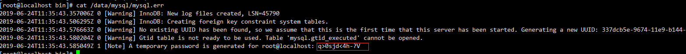

# 固定ip

1. 选择桥接模式
2. 修改 vi /etc/sysconfig/network-scripts/ifcfg-ens33 有可能不是ens33）
```shell
BOOTPROTO="static"
ONBOOT="yes"
IPADDR="192.168.1.187"
NETMASK="255.255.255.0"
GATEWAY="192.168.1.1"
DNS1="192.168.1.1"
```
3. 重启网卡：service network restart
4. 测试是否能ping通外网：ping www.baidu.com

# 配置java环境

1. 下载jdk安装包，并解压
2. 修改配置文件: vi /etc/profile
```shell
# 最后一行添加
#java enviroment
export JAVA_HOME=/usr/java/jdk1.8.0_221
export CLASSPATH=.:${JAVA_HOME}/jre/lib/rt.jar:${JAVA_HOME}/lib/dt.jar:${JAVA_HOME}/lib/tools.jar
export PATH=$PATH:${JAVA_HOME}/bin
```
3. 让配置文件生效：source /etc/profile
4. 查看结果：java -version

# 配置maven

1. 前往 /usr/maven 文件夹，下载包
```shell
# -P 指定下载目录
wget -P /usr/maven/ https://mirrors.bfsu.edu.cn/apache/maven/maven-3/3.6.3/binaries/apache-maven-3.6.3-bin.tar.gz
```
2. 解压：tar -xzvf apache-maven-3.6.3-bin.tar.gz
3. 修改maven配置文件：setting.xml
4. 修改环境变量：vi /etc/profile
```shell
export MAVEN_HOME=/usr/maven/apache-maven-3.6.3
export PATH=$MAVEN_HOME/bin:$PATH
```
+ 使配置文件生效
```shell
source /etc/profile
```

# 安装git

+ yum方式
```shell
# 版本很低
yum -y install git
```

# 安装net-tools 

yum -y install net-tools

# 安装 iptables

```shell
# 停止 firewalld 服务
systemctl stop firewalld.service
# 禁止 firewalld 服务在系统启动的时候自动启动
systemctl disable firewalld.service
# 安装 iptables
yum install -y iptables-services
# 添加开机启动
systemctl enable iptables.service
```

# 关闭 SELinux

```shell
sed -i 's|SELINUX=enforcing|SELINUX=disabled|' /etc/sysconfig/selinux
```


# 开放端口

```shell
# 添加配置文件
vi /etc/sysconfig/iptables

# 添加
-A INPUT -m state --state NEW -m tcp -p tcp --dport 10000 -j ACCEPT
-A INPUT -m state --state NEW -m tcp -p tcp --dport 80 -j ACCEPT
-A INPUT -m state --state NEW -m tcp -p tcp --dport 50000 -j ACCEPT

# 重启iptables
service iptables restart
```

# 切换yum的源

```shell
# 备份当前yum源防止出现意外还可以还原回来
cd /etc/yum.repos.d/
cp CentOS-Base.repo CentOS-Base-repo.bak

# 使用wget下载阿里yum源repo文件
wget -P /etc/yum.repos.d/ http://mirrors.aliyun.com/repo/Centos-7.repo

# 清理旧包
yum clean all

# 把下载下来阿里云repo文件设置成为默认源
mv Centos-7.repo CentOS-Base.repo

# 生成阿里云yum源缓存并更新yum源
yum makecache
yum update
```


# 安装gitlab(社区版)

+ 企业版部分功能需要缴费，例如push功能

```shell
# 安装依赖
yum install -y curl postfix policycoreutils-python openssh-server

# 安装gitlab
curl https://packages.gitlab.com/install/repositories/gitlab/gitlab-ce/script.rpm.sh | sudo bash
# 将http://ip作为您要访问GitLab的域名,安装过程将自动配置并启动该域名的GitLab
EXTERNAL_URL="http://ip" yum install -y gitlab-ce

# 查看运行状态
gitlab-ctl status

# 启动gitlab服务
sudo gitlab-ctl start

# gitlab服务停止
sudo gitlab-ctl stop

# 重启gitlab服务
sudo gitlab-ctl restart

# 重新加载配置文件
gitlab-ctl reconfigure
```

+ 重装完成后访问地址就可以了，默认80端口，默认用户名root，如果访问不了就是端口未开放
+ 配置邮箱
```shell
vim /etc/gitlab/gitlab.rb

gitlab_rails['smtp_enable'] = true
gitlab_rails['smtp_address'] = "smtp.qq.com"
gitlab_rails['smtp_port'] = 465
gitlab_rails['smtp_user_name'] = "1032188134@qq.com"  # 你自己QQ号
gitlab_rails['smtp_password'] = "*************"  # QQ授权码
gitlab_rails['smtp_domain'] = "smtp.qq.com"
gitlab_rails['smtp_authentication'] = "login"
gitlab_rails['smtp_enable_starttls_auto'] = true
gitlab_rails['smtp_tls'] = true
gitlab_rails['gitlab_email_from'] = '1032188134@qq.com'   # 你自己QQ号
```
+ 使配置生效：gitlab-ctl reconfigure

+ 邮箱测试
```shell
gitlab-rails console Notify.test_email('yoyo_你自己随便邮箱@qq.com', '邮件标题_test', '邮件正文_test').deliver_now
```

+ 配置钉钉机器人：http://www.eryajf.net/406.html
+ 控制台修改管理员密码：https://www.cnblogs.com/heyongboke/p/9968506.html
+ 参考博客
   + https://blog.csdn.net/weixin_43767602/article/details/84568858

# 安装jenkins

+ Jenkins下载页面（不需要手动下载）：https://pkg.jenkins.io/redhat-stable/
+ 执行以下命令：
```shell
sudo wget -O /etc/yum.repos.d/jenkins.repo https://pkg.jenkins.io/redhat-stable/jenkins.repo
sudo rpm --import https://pkg.jenkins.io/redhat-stable/jenkins.io.key
yum install -y jenkins
```
+ 修改配置文件：
```shell
# 端口号改成8081
vi /etc/sysconfig/jenkins

JENKINS_PORT="8081"
```
+ 开启Jenkins服务
```shell
systemctl start jenkins
```

+ 在全局配置中配置git，java，maven

+ 可能出现的问题
   + 第一次启动失败时：https://blog.csdn.net/hehaimingg/article/details/106849964

# gitlab jenkins 集成

https://www.cnblogs.com/yanjieli/p/10613212.html

# jenkins构架钉钉通知

https://www.cnblogs.com/fanpl/articles/12875989.html

# 配置jekins打包脚本

# 安装MySQL

+ 下载地址：https://dev.mysql.com/downloads/mysql/5.7.html#downloads

```shell
# 解压 
tar -xvf mysql-5.7.31-linux-glibc2.12-x86_64.tar

# 重命名
mv mysql-5.7.31-linux-glibc2.12-x86_64 /usr/mysql

# 创建mysql用户组和用户并修改权限
groupadd mysql
useradd -r -g mysql mysql

# 创建数据目录并赋予权限
mkdir -p  /data/mysql              #创建目录
chown mysql:mysql -R /data/mysql   #赋予权限

# 配置my.cnf，清空里面原有的内容，将以下内容复制进去
vim /etc/my.cnf

[mysqld]
bind-address=0.0.0.0
port=3306
user=mysql
basedir=/usr/mysql
datadir=/data/mysql
socket=/tmp/mysql.sock
log-error=/data/mysql/mysql.err
pid-file=/data/mysql/mysql.pid
#character config
character_set_server=utf8mb4
symbolic-links=0
explicit_defaults_for_timestamp=true
```

+ 初始化数据库

```shell
# 进入mysql的bin目录
cd /usr/mysql/bin/

# 初始化
./mysqld --defaults-file=/etc/my.cnf --basedir=/usr/mysql/ --datadir=/data/mysql/ --user=mysql --initialize

# 查看密码
cat /data/mysql/mysql.err
```



+ 启动mysql，并更改root 密码

```shell
# 先将mysql.server放置到/etc/init.d/mysql中
cp /usr/mysql/support-files/mysql.server /etc/init.d/mysql

# 配置开机自启动
chmod 777 /etc/init.d/mysql    # 对文件赋予执行权限
chkconfig --add mysql    # 增加mysql服务
chkconfig --list mysql    # 查询mysql服务情况,mysqld 0:off 1:off 2:on 3:on 4:on 5:on 6:off    默认的运行级别为2,3,4,5 
chkconfig --level 345 mysql on    # 如果3，4，5 为off

# 启动
service mysql start
 
ps -ef|grep mysql

# 登陆mysql
./mysql -u root -p   #bin目录下

# 再执行下面三步操作，然后重新登录。
SET PASSWORD = PASSWORD('123456');
ALTER USER 'root'@'localhost' PASSWORD EXPIRE NEVER;
FLUSH PRIVILEGES;                                 

# 执行以下步骤，配置客户端链接
use mysql                                            #访问mysql库
update user set host = '%' where user = 'root';      #使root能再任何host访问
FLUSH PRIVILEGES;                                    #刷新
```

+ 开放端口：3306，重启服务器
+ 博客：https://blog.csdn.net/qq_37598011/article/details/93489404

# 安装docker

+ 安装docker：yum install -y docker
+ 查看docker是否安装成功：yum list installed |grep docker
+ 启动docker服务(并设置开机自启)
```shell
systemctl start docker.service
ystemctl enable docker.service
```
+ 查看docker服务状态：systemctl status docker

# 配置idea连接docker(次级考虑)

1. 配置docker的远程端口
    1. vim /usr/lib/systemd/system/docker.service
    2. 找到ExecStart，在最后追加：-H tcp://0.0.0.0:2375
2. 重启docker
    1. systemctl daemon-reload
    2. systemctl stop docker
    3. systemctl start docker
3. 将2375端口放开
4. idea下载docker插件，配置为tcp socket 连接并输入：tcp://虚拟机地址:2375

# 安装jenkins--docker（次级考虑）

1. 拉去镜像：docker pull jenkinsci/blueocean
2. 运行镜像：修改主机8081端口映射到镜像中的8080端口，如果运行报错显示iptables的问题，则尝试重启iptables一次
docker container run --name jenkins-blueocean --restart=always --detach \
  --volume jenkins-data:/var/jenkins_home \
  --volume jenkins-docker-certs:/certs/client:ro \
  --volume /opt/maven:/var/jenkins_home/maven \
  --publish 8081:8080 --publish 50000:50000 jenkinsci/blueocean
3. 进入容器内部控制台：docker container exec -it jenkins-blueocean bash
4. 去 /var/jenkins_home/secrets 文件夹下找到 initialAdminPassword 文件，查看初始密码
5. 查看日志：docker container logs jenkins-blueocean
6. 安装gitlab插件，钉钉插件(钉钉通知暂时不能集成进去)，maven插件


