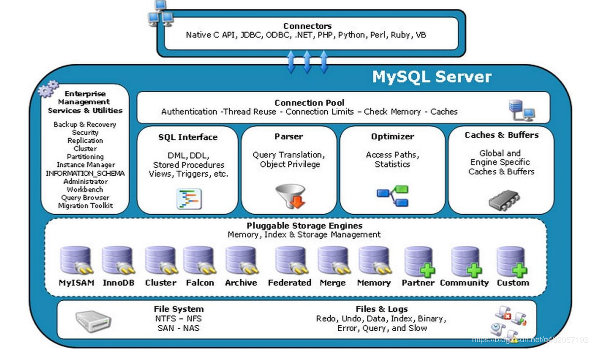
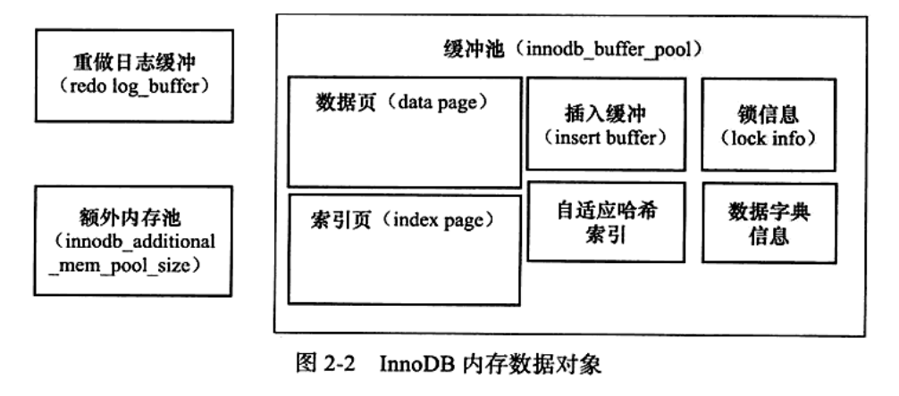

+ 查看mysql启动时查找的配置文件：mysql --help ｜ grep my.cnf，会按照给出的结果顺序查找

+ 配置文件中的datadir指明了数据库数据的路径，但最终只想了/opt/mysql_data目录

+ 从概念上讲，数据库是文件的集合，是依照某种数据模型组织起来并存放于二级存储器中的数据集合；数据库实例是程序，是位于用户和操作系统之间的一层数据管理软件，用户对数据库数据的任何操作都是在数据库实例下进行的，应用程序只有通过数据库实例才能与数据库打交道。

+ 存储引擎
   + 是基于表的，而不是数据库
   + 每个引擎都有各自的特点，能够根据不同的情况建立不同的存储引擎表

+ mysql体系机构，如下图
   + 连接池组件
   + 管理服务和工具软件
   + SQL接口组件
   + 查询分析器组件
   + 优化器组件
   + 缓冲（Cache）组件
   + 插件式存储引擎
   + 物理文件



+ MyISAM存储引擎
   + 不支持事务，主要面向一些OLAP数据库应用
   + 特点：
      + 表锁设计，支持全文索引

# InnoDB存储引擎

   + 支持事务，设计目标主要面向在线事务处理（OLTP）的应用
   + 特点：
      + 行锁设计、支持外健、默认读取操作不会产生锁
      + 通过多版本并发控制（MVCC）来获得高并发性
      + 实现了SQL标准的四种隔离级别，默认REPEATABLE级别
      + 使用一种next-keylocking的策略来避免幻读
      + 对于表中数据的存储，InnoDB存储引擎采用了聚集（clustered）的方式，因此每张表的存储都是按主键的顺序进行存放。如果没有显式的在表中指定主键，则会为每一行生成6字节的ROWID，并以此作为主键
   + 通过 ``` show engine innodb status; ```查看存储引擎状态

## 体系架构


   + 由多个内存块组成的内存池
   + 后台线程主要负责刷新内存池中的数据，保证缓冲池中的内存缓存的都是最近的数据；此外将已修改的数据刷新到磁盘文件；同时保证在数据库发生异常的情况下InnoDB能恢复到正常运行状态。

### 后台线程

InnoDB是多线程模型，因此其后台有多个不同的后台线程，负责不同的任务。

#### Master Thread

   + 是一个非常核心的后台线程主要负责将缓冲池中的数据异步刷新到磁盘中，保持数据的一致性，包括脏页的刷新、合并插入缓冲、UNDO页的回收；

#### IO Thread

   + 大量使用了AIO（Async IO）来处理写IO请求，这样可以极大的提高数据库性能，而IO Thread的工作就是负责这些IO请求的回调处理； 
   + IO Thread分为4种，分别是read（4个），write（4个），insert buffer（1个）和log IO thread（1个）；
   + innodb_read_io_threads和innodb_write_io_threads来分别设置read和write的数量，并且write线程的ID总是小于read线程；

#### Purge Thread

   + 事务被提交后，其所使用的undolog可能不再需要，因此需要PurgeThread来回收已经使用的并分配的undo页。
   + 可以通过 ``` innodb_purge_threads=线程数量 ``` 来设置数量
   + 通过 ``` show variables like 'innodb_purge_threads'; ``` 查看数量；

#### Page Cleaner Thread

   + 将之前版本中脏页的刷新操作都放入到单独的线程中完成，减轻master thread的压力以及对于用户查询线程的阻塞；

### 内存



#### 缓冲池

   + 简单来说就是一块内存区域，通过内存的速度弥补磁盘速度较慢对数据库性能的影响；
   + 缓存池的大小直接影响数据库的整体性能；
   + 读操作：首先将从磁盘读取到的页存放在缓存池中，这个过程称为将页“FIX”在缓存池中。下一次再读相同的页时，首先判断该页是否在缓存池中。若在缓存池中，称该页再缓存池中被命中，直接读取该页。否则，读取磁盘上的页。
   + 写操作：首先修改在缓存池中的页，然后再以一定的频率刷新到磁盘上。这里需要注意的是，页从缓存池刷新回磁盘的操作并不是每次页发生更新时触发，而是通过一种Checkpoint的机制刷新回磁盘；
   + 缓存池大小
      + 通过 ``` innodb_buffer_pool_size ``` 来设置大小；
      + 使用 ``` show variables like 'innodb_buffer_pool_size'; ``` 查看缓存池大小
   + 缓存池数量
      + 允许有多个缓存池实例，每个页根据哈希值平均分配到不同缓存池实例中，这样做可以减少数据库内部的资源竞争，增加数据库的并发处理能力；
      + 通过 ``` innodb_buffer_pool_instances ``` 来设置缓存池实例数量；
      + 使用 ``` show variables like 'innodb_buffer_pool_instances'; ``` 查看缓存池实例数量；

#### LRU List、Free List和Flush List

通常来说，数据库中的缓存池是通过LRU（Latest Recent Used，最近最少使用）算法来进行管理的。即最频繁使用的页在LRU列表的前端，而最少使用的页在LRU列表的尾端。当缓冲池不能存放新读取到的页时，将首先释放LRU列表中尾端额页。

在InnoDB存储引擎中，缓冲池中页的大小默认为16KB，同样使用LRU算法对缓存池进行管理。稍有不同的是InnoDB存储引擎对传统的LRU算法做出了一些优化。在InnoDB的存储引擎中，LRU列表中还加入了midpoint位置。新读取到的页，虽然是最新访问的页，但并不是直接放入到LRU列表首部，而是放入到midpoint位置。这个策略被称为midpoint insertion strategy。在默认配置下，该位置位于LRU列表长度的5/8出，通过 ``` innodb_old_blocks_pct ``` 控制。