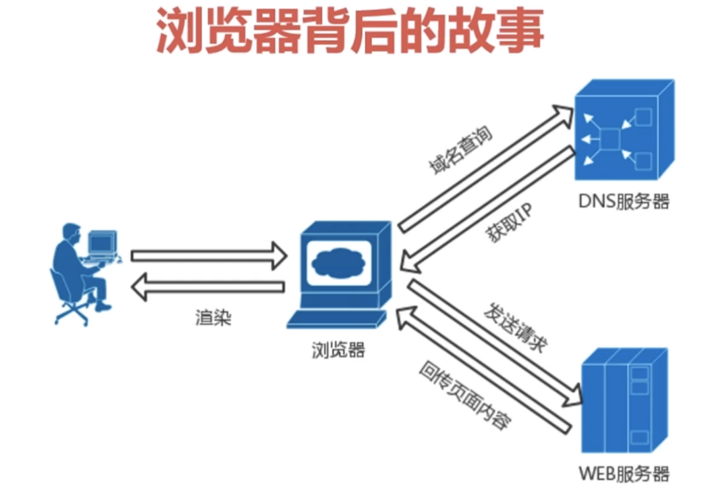

 # HTTP

 超文本传输协议（HTTP）是一种通信协议，是一个属于应用层的面向对象的协议，它允许将超文本标记语言（HTML）文档从Web服务器传送到客户端浏览器。

## 基础概念

### 浏览器工作流程

 

 1. 用户打开浏览器，输入网址；
 2. 浏览器请求DNS服务器，进行域名解析；
 3. DNS服务器返回给浏览器域名对应的IP；
 4. 浏览器根据返回的ip，寻找对应的web服务器发送请求；
 5. web服务器返回页面内容（页面源代码）；
 6. 浏览器根据web浏览器返回的页面内容（页面源代码）进行渲染，最后呈现给用户；

 ### Web与HTTP

 Web是一种基于超文本和HTTP的，全球性的，动态交互的，跨平台的分布式图形信息系统。 

 HTTP协议是构建在TCP/IP协议之上的，是TCP/IP协议的一个子集。