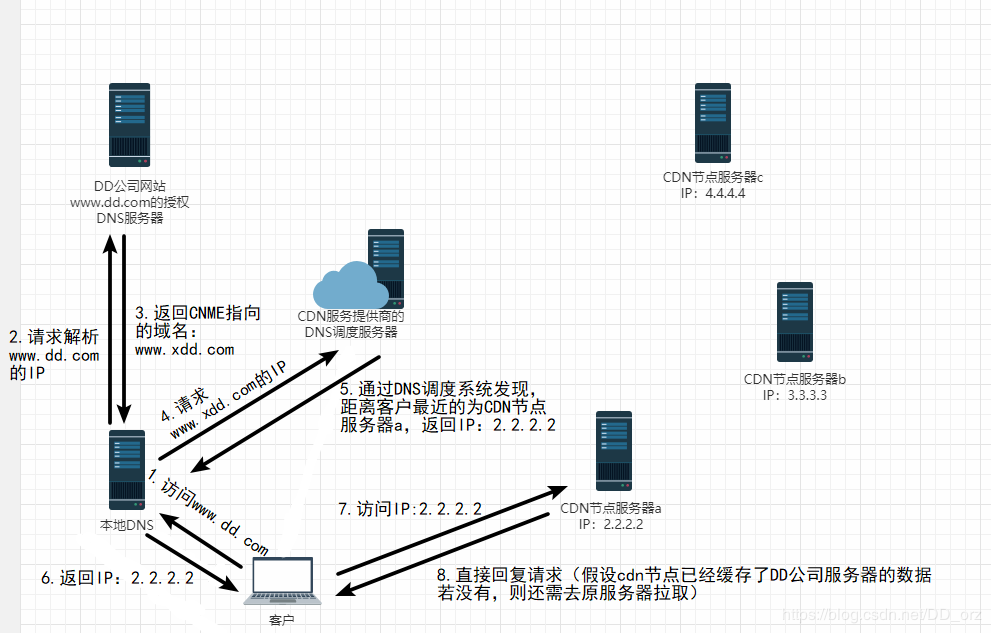

# CDN

假如你是DD公司老板，你公司中的一台IP为1.1.1.1的服务器，注册了域名为www.dd.com，要对外提供客户访问。随着公司越做越大，访问量也越来越多，服务器顶不住了，你去找CDN提供商购买CDN加速服务，这个时候他们要求你的域名做个CNAME指向他们给你的一个域名叫www.xdd.com，当用户访问www.dd.com的时候，本地DNS会获得CDN提供的CNAME域名：www.xdd.com，然后再次向DNS调度系统发出请求，通过DNS调度系统的智能分析，把这个www.xdd.com指向一个（离用户地理位置最近的）CDN提供商的服务器IP，让用户就近取到想要的资源（如访问网站），大大降低了延迟。